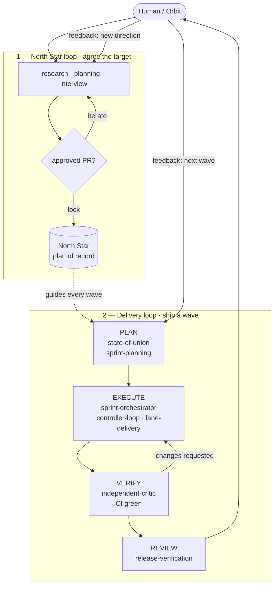

# Verdify Lifecycle Skills

Verdify is an end-to-end, GitHub-native operating system for moving software work from uncertain project context to verified deployment. It packages eighteen coherent lifecycle Agent Skills, one standalone issue-triage skill, deterministic repository tooling, schemas, GitHub templates, and a lane/worktree execution model.

The repository is deliberately not one giant sprint prompt. Lifecycle skills own bounded responsibilities, consume durable artifacts, produce durable artifacts, and hand off without relying on hidden chat history. Standalone skills support adjacent GitHub-native work without entering the lifecycle graph.

`config/lifecycle.yaml` is the canonical source for lifecycle skills, standard states, modes, ordering, and standalone skill treatment. `verdify.workflow.yaml`, router behavior, docs, and SKILL.md frontmatter are derived views that must validate against that config.

## The loops

Two loops drive every repository. A **North Star loop** agrees the target and locks it as plan of record with an approved PR. A **delivery loop** then ships one reviewable wave at a time through plan → execute → verify → review. A human (or Orbit) stays in the loop at review, and the locked North Star guides every wave.



## Lifecycle

```text
project-router
  -> transcript-replan
       transcript evidence -> routed proposals -> conflicts/gates
  -> northstar-research-ingest
       research files -> collateral copies -> queryable evidence registry
  -> northstar-planning
       registered evidence + ideation + requirements + feedback -> self-improving drafts -> locked North Star
  -> northstar-interview
       review-ready drafts + evidence -> prioritized Q&A -> feedback routing
  -> northstar-question-resolution
       large question corpus -> clustered research -> delegated answers -> planning handoff
  -> project-definition
       discovery -> requirements -> product -> design surface
  -> architecture-contracts
       north-star architecture -> black-box module contracts
  -> state-of-union
       source freshness + backlog + health triage -> execution strategy -> next sprint candidates
  -> repo-hygiene
       Wave 0 compliance -> safe cleanup -> hygiene gate
  -> sprint-planning
       issue selection -> sprint plan -> lane topology -> owners/review plan -> lane contracts -> wave release plan
  -> sprint-orchestrator
       execution runbook -> Agent Platform dispatch -> monitor -> reconcile
       |-> controller-loop (durable controller state + session ledger)
       |-> platform-readiness (Agent Platform, environment/GitOps gates, and control requests)
       |-> gravity-readiness (Gravity pilot gate + core extraction plan)
       |-> lane-delivery (one worker session in one worktree)
       |-> independent-critic (fresh session and review worktree)
  -> release-verification
       review inbox packet -> diagnostics -> integration -> deployment verification -> outcome review
  -> project-router
```

The 17 detailed delivery stages from the original outline remain represented in `verdify.workflow.yaml` as a legacy compatibility outline with canonical skill/mode pairs; readiness and controller-loop skills add the gates needed to turn transcript-driven planning into safe autonomous execution.

## Non-negotiable operating model

- **GitHub is the control plane.** Issues, pull requests, checks, reviews, releases, and deployments are the operational source of truth.
- **GitHub Issues are the backlog.** Every approved implementation lane maps to an issue. Discovered work becomes another issue rather than unapproved scope.
- **Typed authority prevents competing truths.** Issues own backlog intent; lane contracts own executable scope; pull requests own proposed code; the default branch owns accepted code; ADRs own architecture decisions; checks and deployment records own evidence.
- **One issue = one lane = one branch = one worktree = one pull request** by default. A coupled multi-issue lane requires an explicit justification and approval.
- **One coding agent/session per worktree.** Agent Platform MCP/API creates the
  worker session recorded in the sprint execution runbook; a local lease
  prevents two workers from owning the same lane. Critics use a fresh session
  and a separate detached review worktree.
- **Worktrees are disposable execution locations, not durable identity.** Lane ID, issue, branch, baseline SHA, contract, and lease identify work.
- **No self-certification.** Deterministic checks, a fresh critic, and a
  complete review inbox packet precede integration when work claims review-ready
  status.
- **Merge is not deployment.** The intended revision must be proven in the target environment before outcome acceptance.

See `config/authority-matrix.yaml`, `COMMON_OPERATING_CONTRACT.md`, and `docs/lane-worktrees.md` for the precise rules.

## Repository contents

```text
skills/                     Eighteen lifecycle skills plus issue-triage
.agents/skills/             Codex discovery links
.claude/skills/             Claude Code discovery links
bin/verdify                 Dependency-free lifecycle CLI
lib/verdify/                CLI, Git, schema, and routing implementation
schemas/                    Canonical artifact schemas
config/                     Authority, lifecycle, GitHub, and policy defaults
.github/                    Issue forms, PR template, CODEOWNERS, workflows
examples/minimal-project/   A complete validated artifact chain
verdify.workflow.yaml       Full lifecycle and lane child workflow
```

There are no duplicated root prompt packs or schema copies inside individual skills. Skill detail is progressively disclosed through focused `references/` files.

Gravity reuse planning stays under `gravity-readiness`: when Sunshine-to-Gravity
extraction is in scope, record a validated
`.agent-workflow/gravity/gravity-core-extraction-plan.yaml` before any Gravity
implementation lane opens.

## Validate this package

Requirements: Ruby 3.1+, Git, and Bash. Node.js/npm are required for the `npx` installer test. GitHub CLI is required only for GitHub synchronization commands.

```bash
make test
```

The validator checks skill frontmatter, references, host links, workflow transitions, schemas, example artifacts, issue forms, evaluations, executable scripts, and duplicate-content guardrails.

Release archives include `MANIFEST.sha256`. Verify an archive after download with:

```bash
bash scripts/verify-package.sh /path/to/verdify-lifecycle-skills-v1.0.0.zip
```

## Branch and release flow

`dev` is the long-running development integration branch. Implementation and
lane pull requests target `dev`. `main` is the protected release branch; it
should only receive release pull requests from `dev`.

Every push to `dev` runs validation and `.github/workflows/release-pr.yml`,
which opens or updates a `dev -> main` release PR for the current package
version. The workflow also creates a matching GitHub Issue for that release
version and links it from the PR body, keeping GitHub Issues as the backlog
source of truth.

Merging the release PR into `main` publishes that exact version to npm as
`@verdify-cli/cli@latest`, creates tag `vX.Y.Z`, and creates the GitHub release.
Direct pushes to `main` are a policy violation once branch protection/rulesets
are configured.

## Release this package

Before pushing the release candidate to `dev`, update:

- `package.json`
- `VERSION`
- each `skills/*/SKILL.md` `metadata.version`
- `CHANGELOG.md`

Then run:

```bash
make test
ruby scripts/release-preflight.rb --require-unpublished
```

The `validate` workflow runs the same release preflight for PRs targeting
`main`, including the check that the proposed npm version is not already
published. After the `dev -> main` release PR is merged,
`.github/workflows/publish-npm.yml` builds and verifies the release archive,
publishes to npm using Trusted Publishing/OIDC, tags the commit as `vX.Y.Z`, and
creates a GitHub release with the zip and checksum.

Configure npm Trusted Publishing for the `publish-npm.yml` workflow and the
`npm` GitHub environment before relying on the release workflow. Do not add a
long-lived `NPM_TOKEN` unless Trusted Publishing is unavailable.

For automatic release PR creation, add a fine-scoped `VERDIFY_RELEASE_PR_TOKEN`
repository secret with permission to create issues and pull requests in this
repository. The VerdifyConsultancy organization currently blocks the repository
setting that would let the built-in `GITHUB_TOKEN` create pull requests.

## Install in a target repository

Run one command from the target repository root:

```bash
npx @verdify-cli/cli@latest init
```

Pin the version for reproducible setup:

```bash
npx @verdify-cli/cli@1.0.0 init
```

The installer creates a small, explicit agent footprint:

```text
.agent-skills/
  verdify-skills/
    1.0.0/
.agent-workflow/
  config.yaml
  router/
  project/
  architecture/
  sprints/
.agents/
  skills/
AGENTS.md
```

`.agent-skills` contains the installed Verdify skills package. `.agent-workflow` contains durable project workflow artifacts such as route decisions, definitions, contracts, sprint records, status, and evidence. `.agents/skills` contains host discovery symlinks into the installed package.

Update an installed target repository to the latest published skills package by
rerunning the installer from that repository root:

```bash
npx -y @verdify-cli/cli@latest init
```

Use `--force` only when reinstalling the same version or intentionally replacing
Verdify-owned starter files:

```bash
npx -y @verdify-cli/cli@latest init --force
```

Use the Ruby CLI directly when developing against a local checkout:

```bash
/path/to/verdify-skills/bin/verdify init --repo /path/to/target
/path/to/verdify-skills/bin/verdify doctor --repo /path/to/target
/path/to/verdify-skills/bin/verdify route --repo /path/to/target --write
```

Start a sprint after project and module contracts are approved:

```bash
bin/verdify sprint init --repo /path/to/target --id 2026-06-22-a
```

After `sprint-planning` creates an approved lane contract, dispatch exactly one worker session:

```bash
skills/sprint-orchestrator/scripts/build_execution_runbook.rb \
  --repo /path/to/target \
  --sprint 2026-06-22-a \
  --controller-session-id controller-20260622-001

skills/sprint-orchestrator/scripts/build_platform_control_requests.rb \
  --repo /path/to/target \
  --runbook /path/to/target/.agent-workflow/sprints/2026-06-22-a/execution/sprint-execution-runbook.yaml

bin/verdify lane create \
  --repo /path/to/target \
  --sprint 2026-06-22-a \
  --lane-id issue-123-api \
  --issue 123 \
  --session-id codex-20260622-001 \
  --agent codex
```

The execution runbook is the controller's durable plan for Agent Platform lane
session creation, tmux/browser terminal visibility, polling cadence, CI/CD,
review deployment readiness, and session-ledger coverage. If the configured
Agent Platform MCP/API operation is unavailable, stop and route to
`platform-readiness` or a gate instead of spawning an ad hoc local worker.

Compile a bounded worker prompt from authoritative inputs:

```bash
bin/verdify prompt compile \
  --repo /path/to/target \
  --contract .agent-workflow/sprints/2026-06-22-a/lanes/contracts/issue-123-api.contract.yaml \
  --role worker
```

Create a fresh detached worktree for independent review:

```bash
bin/verdify lane review \
  --repo /path/to/target \
  --lane-id issue-123-api \
  --session-id critic-20260622-001 \
  --agent codex
```

## GitHub bootstrap and reconciliation

Preview the idempotent label setup:

```bash
bin/verdify github bootstrap --repo OWNER/REPOSITORY
```

Apply it explicitly:

```bash
bin/verdify github bootstrap --repo OWNER/REPOSITORY --apply
```

Capture a local cache of current issues and pull requests, then compare it with lane contracts:

```bash
bin/verdify github snapshot --repo OWNER/REPOSITORY --target /path/to/target
bin/verdify github reconcile --repo-path /path/to/target --sprint 2026-06-22-a
```

GitHub remains authoritative; `.agent-workflow/github/snapshot.json` is an ignored cache.
When backlog strategy depends on issue, PR, lane, check, deployment, log,
telemetry, dependency, or Project state, record a validated
`.agent-workflow/strategy/github-backlog-sync.yaml` artifact under
`state-of-union`.

## Agent host setup

This repository exposes every canonical skill to Codex and Claude Code through symlinks:

```bash
ruby scripts/setup-agent-hosts.rb --check
```

For ephemeral use from another repository, pin an immutable release or commit:

```bash
VERDIFY_SKILLS_REF=v1.0.0 \
curl -fsSL https://raw.githubusercontent.com/VerdifyConsultancy/verdify-skills/v1.0.0/scripts/bootstrap-agent-session.sh \
  | bash -s -- codex "$PWD"
```

The bootstrapper rejects moving refs such as `main` unless `VERDIFY_ALLOW_MOVING_REF=1` is explicitly set.

## Repository-specific setup still required

Before enforcing code-owner review, replace the commented example in `.github/CODEOWNERS`. Repository administrators should also configure a ruleset or protected branch for `main` with required checks (`validate`, `pull-request-policy`, and `compliance / compliance`), at least one approving review, conversation resolution, no direct pushes, and no force pushes or branch deletion. On busy repositories, add a merge queue. Deployment environments and their approvers remain project-specific.

## Design documentation

- **`docs/skills/README.md` — the skills reference manual**: per-skill purpose, inputs, outputs, owned schemas, sequence diagrams, tools/MCP, and handoffs for all 21 skills, plus a 46-schema catalog, a CLI/MCP/GitHub tools reference, and end-to-end sequence diagrams
- `docs/lifecycle.md` — stages, handoffs, and gates
- `docs/authority-model.md` — typed source-of-truth boundaries
- `docs/github-operating-model.md` — issues, PRs, Projects, checks, and deployments
- `docs/lane-worktrees.md` — lane leases, worktrees, runtime namespaces, and cleanup
- `docs/northstar/README.md` - North Star evidence ledger and planning inputs
- `docs/security-and-permissions.md` — least privilege and production separation
- `docs/research/industry-alignment.md` — primary-source design rationale
- `docs/migration-from-v0.1.md` — migration from the original single sprint skill
