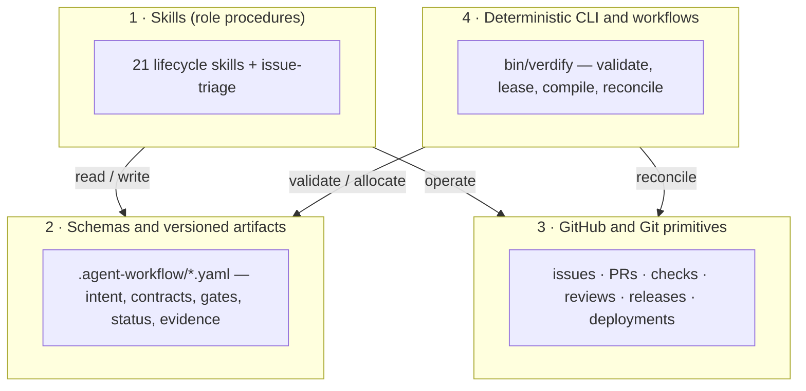

# Repository architecture

The package has four layers:

1. **Skills** provide role-specific procedures and progressive disclosure.
2. **Schemas and versioned artifacts** carry intent, contracts, gates, status, and evidence between sessions.
3. **GitHub and Git primitives** own backlog, review, checks, code, releases, and deployment records.
4. **Deterministic CLI and workflows** validate artifacts, allocate worktrees, enforce leases, compile prompts, and reconcile state.

The CLI intentionally has no third-party runtime dependencies. It uses Ruby's standard library and delegates source-control operations to Git and remote operations to GitHub CLI.

The skill package never attempts to become a second issue tracker or a hidden workflow database. A future durable workflow engine may coordinate transitions, but it should store references to authoritative artifacts rather than duplicate their content.

## See also

- [`skills/README.md`](skills/README.md) — the skills reference manual (per-skill pages, diagrams, handoffs)
- [`skills/schemas-catalog.md`](skills/schemas-catalog.md) — the 46 schemas, owners, and producers/consumers
- [`skills/tools-and-mcp.md`](skills/tools-and-mcp.md) — `bin/verdify` CLI, Agent Platform MCP/API, GitHub primitives
- [`authority-model.md`](authority-model.md) — which artifact type owns which truth
