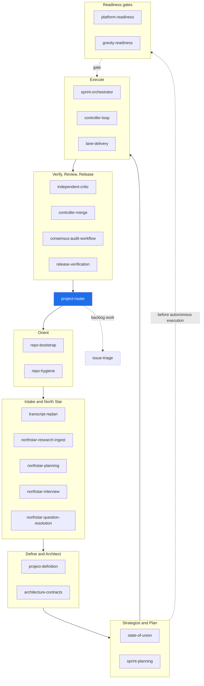
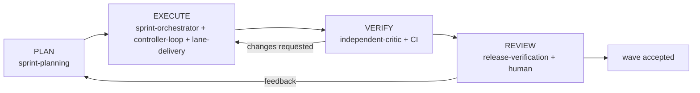

# Verdify Skills Reference

This is the reference manual for the **21 Verdify lifecycle skills** — what each
one does, what it reads, what it writes, the schemas it owns, the tools it calls,
and how it hands off. It complements the prose in [`../lifecycle.md`](../lifecycle.md)
(stages and gates), [`../authority-model.md`](../authority-model.md) (who owns what
truth), and [`../github-operating-model.md`](../github-operating-model.md).

- **Per-skill pages:** [`per-skill/`](per-skill/) — one page per skill.
- **Schema catalog:** [`schemas-catalog.md`](schemas-catalog.md) — all 46 schemas, owners, producers/consumers.
- **Tools & MCP:** [`tools-and-mcp.md`](tools-and-mcp.md) — `bin/verdify` CLI, Agent Platform MCP/API, GitHub primitives.
- **Sequences:** [`sequences.md`](sequences.md) — end-to-end flows as mermaid sequence diagrams.

## What the system is

Verdify moves a repository from uncertain intent to verified deployment through a
chain of **bounded skills** that read and write **durable `.agent-workflow` artifacts**
and treat **GitHub** as the control plane. No skill relies on hidden chat history;
each consumes typed artifacts and produces typed artifacts for the next role. See
[`../../COMMON_OPERATING_CONTRACT.md`](../../COMMON_OPERATING_CONTRACT.md).

`project-router` is the entrypoint: it inspects state and names exactly one next
skill + mode. The cycle returns to the router after each handoff.

## The lifecycle



## The execution loop

Inside `Execute → Verify → Review`, the controller runs the delivery heart. A
**wave** is the bounded slice presented for human review; a **lane** is one
worker's leased worktree; a **task/issue** is the committed unit. CI green is
necessary but not sufficient — a fresh critic and review evidence gate integration.



## The 21 skills

| # | Skill | Does | Owns schemas |
|---|---|---|---|
| 1 | [project-router](per-skill/project-router.md) | Choose the next lifecycle skill + mode | `route-decision` |
| 2 | [repo-bootstrap](per-skill/repo-bootstrap.md) | Safe repo discovery packet for a new controller | `repo-bootstrap` |
| 3 | [transcript-replan](per-skill/transcript-replan.md) | Route transcripts into proposed lifecycle changes | `transcript-replan` |
| 4 | [northstar-research-ingest](per-skill/northstar-research-ingest.md) | Register research as queryable evidence | `northstar-evidence-item`, `northstar-evidence-registry` |
| 5 | [northstar-planning](per-skill/northstar-planning.md) | Self-improving North Star product/architecture loop | `northstar-plan`, `northstar-artifacts`, `northstar-learning-proposals` |
| 6 | [northstar-interview](per-skill/northstar-interview.md) | Prioritized human Q&A before lock | — |
| 7 | [northstar-question-resolution](per-skill/northstar-question-resolution.md) | Inventory, cluster, and resolve gated questions | `northstar-question-*` |
| 8 | [project-definition](per-skill/project-definition.md) | Approved end-to-end project definition | `project-definition` |
| 9 | [architecture-contracts](per-skill/architecture-contracts.md) | North-star architecture + black-box module contracts | `architecture`, `module-contract` |
| 10 | [state-of-union](per-skill/state-of-union.md) | Backlog/health triage → execution strategy | `state-of-union`, `github-backlog-sync` |
| 11 | [repo-hygiene](per-skill/repo-hygiene.md) | Wave 0 compliance gate | `repo-hygiene`, `repo-agent-scope` |
| 12 | [sprint-planning](per-skill/sprint-planning.md) | Sprint plan, lanes, contracts, wave release plan | `sprint-plan`, `lane-contract`, `lane-map`, `wave-release-plan` |
| 13 | [sprint-orchestrator](per-skill/sprint-orchestrator.md) | Dispatch lane sessions, monitor, reconcile | `sprint-execution-runbook`, `status-event` |
| 14 | [controller-loop](per-skill/controller-loop.md) | Durable outer-loop state + session ledger | `controller-state`, `session-ledger` |
| 15 | [platform-readiness](per-skill/platform-readiness.md) | Gate Agent Platform + environment readiness | `platform-readiness`, `agent-platform-control-request`, `environment-gitops-reconciliation` |
| 16 | [gravity-readiness](per-skill/gravity-readiness.md) | Gate Gravity before autonomous build | `gravity-readiness`, `gravity-core-extraction-plan` |
| 17 | [lane-delivery](per-skill/lane-delivery.md) | Implement + close out one leased lane | `lane-closeout` |
| 18 | [independent-critic](per-skill/independent-critic.md) | Fresh-context review of a lane | `critic-report` |
| 19 | [controller-merge](per-skill/controller-merge.md) | Reconcile lane PRs for merge-ready or fix-forward | — |
| 20 | [release-verification](per-skill/release-verification.md) | Review inbox, deploy proof, outcome | `review-inbox-packet`, `release-verification`, `outcome-review`, `observability-diagnostic-packet` |
| 21 | [consensus-audit-workflow](per-skill/consensus-audit-workflow.md) | Skill audit + consensus review | — |
| — | [issue-triage](per-skill/issue-triage.md) | Standalone: research and create GitHub issues | — |

## How to read a per-skill page

Each page follows one template:

```text
# <skill>
Lifecycle order · Modes · Owns schemas · one-line summary
## Purpose
## When to use / when not
## Position in the loop
## Modes (table)
## Inputs consumed (table: input · schema/source · from)
## Outputs produced (table: artifact · schema · consumed by)
## Sequence (mermaid)
## Gates & stop conditions
## Tools used (CLI / MCP / GitHub)
## Handoffs (upstream / downstream)
## References
```

The canonical machine-readable order and modes live in
[`../../config/lifecycle.yaml`](../../config/lifecycle.yaml); each skill's
authoritative behavior lives in `skills/<skill>/SKILL.md`.
