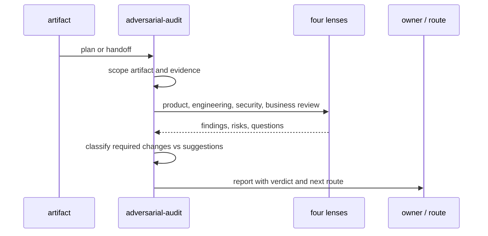

# adversarial-audit

**Lifecycle order:** 20 · **Modes:** `scope`, `lens-review`, `risk-register`, `decision-route` · **Owns schemas:** — (produces Markdown findings)

> Audit sprint plans, skill proposals, PR plans, or generic research handoffs
> through product, engineering, security, and business lenses.

## Purpose

`adversarial-audit` is a focused pressure-test skill. It finds weak assumptions,
missing evidence, product gaps, engineering risks, security issues, and business
tradeoffs before a plan or handoff is approved or executed. It is narrower than
`consensus-audit-workflow` and not a replacement for `independent-critic`.

## When to use / when not

- **Use** for sprint plans, skill proposals, architecture options, PR plans, or
  generic research handoffs that need quick four-lens review.
- **Not** for completed lane code review, consensus-packet approval, protected
  North Star approval, or publishing sensitive security details.

## Position in the loop

Runs as an adversarial planning/review aid before execution, or as a focused
review attachment to issues, PRs, sprint plans, and handoffs. Protected
decisions still route to human gates or consensus review.

## Modes

| Mode | What it does |
|---|---|
| `scope` | Identify artifact, decision, non-goals, evidence, and missing sources. |
| `lens-review` | Apply product, engineering, security, and business lenses. |
| `risk-register` | Classify required changes, risks, questions, and suggestions. |
| `decision-route` | Name the human owner or lifecycle route for unresolved items. |

## Inputs (consumed)

| Input | Source |
|---|---|
| Audited artifact | sprint plan, issue, PR, proposal, handoff |
| Supporting evidence | repository, GitHub, `.agent-workflow`, commands |
| Lens output contract | `skills/adversarial-audit/references/lens-output.md` |

## Outputs (produced)

| Output | Schema | Consumed by |
|---|---|---|
| Markdown audit report | Markdown contract | human reviewer, issue, PR, sprint plan |

## Sequence

## Gates & stop conditions

Stop when evidence is missing, secrets or exploit details would be exposed, the
artifact asks for machine approval of a protected decision, or the task is a
completed-code lane review that belongs to `independent-critic`.

## Tools used

- Repository and GitHub read surfaces.
- Validation commands when the artifact claims validation status.
- Markdown report output from `references/lens-output.md`.

## Handoffs

- **Upstream:** `sprint-planning`, `state-of-union`, `northstar-planning`,
  issues, PRs, and human review.
- **Downstream:** human gate, `sprint-planning`, `sprint-orchestrator`,
  `consensus-audit-workflow`, or a follow-up issue.

## References

- `skills/adversarial-audit/SKILL.md`
- `references/lens-output.md`
