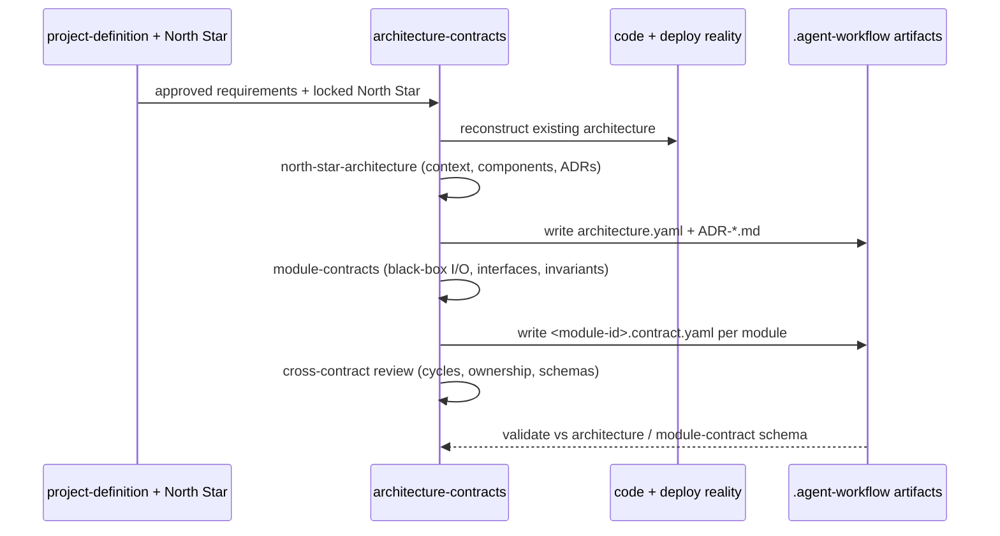

# architecture-contracts

**Lifecycle order:** 9 · **Modes:** `north-star-architecture`, `module-contracts` · **Owns schemas:** `architecture`, `module-contract`

> Create an approved north-star architecture, then convert it into black-box module contracts with stable inputs, outputs, interfaces, ownership, invariants, and validation.

## Purpose

Define the system before dividing implementation work. The architecture describes the
whole — context, components, topology, data, security, deployment, observability, and
risks. Module contracts then carve it into independently buildable **black boxes**: each
contract fixes inputs, outputs, interfaces, ownership, invariants, and validation so an
implementation can vary internally while the boundary stays stable.

## When to use / when not

- **Use** after project definition, when architecture is missing or stale, or before
  strategy review and parallel implementation lanes are planned.
- **Not** for creating sprint lanes or choosing the current slice — that is
  `sprint-planning`. A module may span multiple sprints; a lane implements a bounded
  slice of one module. Material security, migration, public-interface, or deployment
  decisions may require human approval.

## Position in the loop

Foundation work that follows [project-definition](./project-definition.md) and precedes
strategy. It consumes a locked North Star and approved requirements, and hands approved
architecture plus module contracts to [state-of-union](./state-of-union.md) and
[sprint-planning](./sprint-planning.md).

## Modes

| Mode | What it does |
|---|---|
| `north-star-architecture` | Verify North Star + project definition are approved, reconstruct existing code/deploy reality, define system context, components, topology, data flow, storage, integrations, trust boundaries, deployment, observability, and tradeoffs; record ADRs; validate `architecture.yaml`. |
| `module-contracts` | For each module define purpose + requirement IDs, owned/prohibited paths, typed inputs/outputs, public interfaces + compatibility, hard/soft dependencies, invariants + failure behavior, runtime ownership, contract tests, and definition of done; then review all contracts as a set. |

## Inputs (consumed)

| Input | Schema / source | From |
|---|---|---|
| Approved project definition | `project-definition` | `project-definition` |
| Locked North Star | `NORTHSTAR_PRODUCT.md`, `NORTHSTAR_ARCHITECTURE.md`, `northstar-artifacts.yaml` | `northstar-planning` |
| Requirements + design surfaces | requirement IDs (`REQ-*`) | `project-definition` |

## Outputs (produced)

| Output | Schema | Consumed by |
|---|---|---|
| `.agent-workflow/architecture/architecture.yaml` | [`architecture.schema.yaml`](../schemas-catalog.md) | `state-of-union`, `sprint-planning` |
| `.agent-workflow/modules/contracts/<module-id>.contract.yaml` (per module) | [`module-contract.schema.yaml`](../schemas-catalog.md) | `sprint-planning`, `lane-delivery`, `independent-critic` |
| ADRs `decisions/ADR-*.md` (from `assets/ADR.template.md`), `north-star-architecture.md`, `module-map.md`, `dependency-graph.md`, `interface-risk-report.md` | n/a | architecture readers, review |

## Sequence

## Gates & stop conditions

Trace every component, decision, and risk to approved requirements; record material
choices as ADRs with alternatives and consequences. This skill **does not create sprint
lanes**. Cross-contract review rejects shared mutable paths, an output with no consumer
or an input with no producer, dependency cycles without a strategy, undefined public
schemas, ambiguous boundary error/idempotency, tests needing another module's internals,
non-isolatable runtime resources, or a module that is just a layer name. Architecture
and contracts must be approved, versioned on the default branch or an approved PR, and
free of blocking interface risks before handoff.

## Tools used

- **CLI:** `bin/verdify artifact validate --file PATH [--schema PATH]` validates each
  artifact against its `schema_ref` — see [tools-and-mcp](../tools-and-mcp.md).
- **GitHub:** version architecture and contracts on the default branch or an approved PR.

## Handoffs

- **Upstream:** [project-definition](./project-definition.md) (approved definition) and
  `northstar-planning` (locked North Star).
- **Downstream:** [state-of-union](./state-of-union.md) (strategy reconciliation) and
  [sprint-planning](./sprint-planning.md) (slice selection from approved modules).

## References

- `skills/architecture-contracts/SKILL.md`, `references/architecture-mode.md`,
  `references/module-contract-mode.md`, `references/contract-review.md`
- Templates: `assets/architecture.template.yaml`, `assets/module-contract.template.yaml`,
  `assets/ADR.template.md`
- [schemas-catalog](../schemas-catalog.md), [tools-and-mcp](../tools-and-mcp.md)
