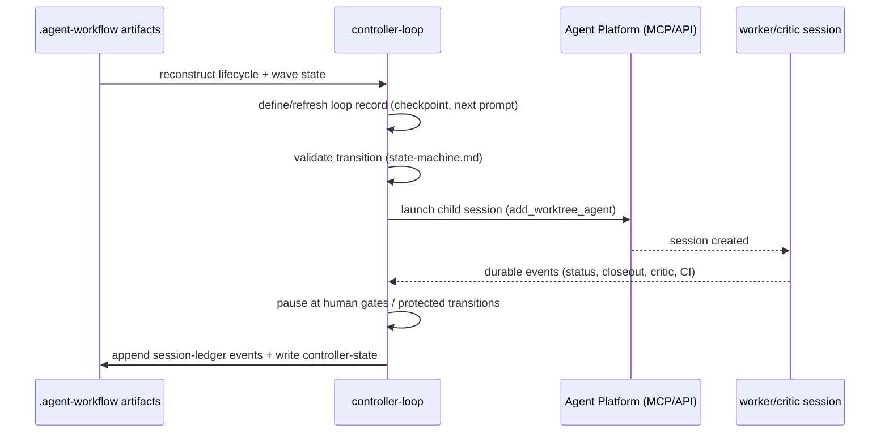

# controller-loop

**Lifecycle order:** 14 · **Modes:** `state-machine`, `session-ledger`, `wave-supervision` · **Owns schemas:** `controller-state`, `session-ledger`

> Persist lifecycle state, wave state, child sessions, gates, status events, and handoffs independently of model conversation history.

## Purpose

Owns the **durable outer-loop contract**. A controller loop reconstructs lifecycle
state from artifacts, supervises child worker/critic sessions and waves, enforces
gates, and persists typed controller state and an append-only session ledger so the
run survives context-window resets, sleeps, and pod restarts.

## When to use / when not

- **Use** when a project needs resumable orchestration across planning, research,
  hygiene, sprint execution, review, fixes, replanning, deployment, and sign-off — or
  to recover a controller after a restart.
- **Not** for implementing lane code, reviewing work, or making protected design
  decisions. Those belong to `lane-delivery`, `independent-critic`, and the human gate.

## Position in the loop

The durable spine of **EXECUTE**. It pairs with `sprint-orchestrator`: per
[ADR-0012](../../decisions/ADR-0012-controller-loop-vs-orchestrator-ownership.md) the
orchestrator drives the per-sprint dispatch transition while controller-loop owns the
session-ledger, controller-state, gate, lease, and recovery writes. One writer per
record avoids split-brain.

## Modes

| Mode | What it does |
|---|---|
| `state-machine` | Reconstruct lifecycle/wave state and validate each transition against `references/state-machine.md`. |
| `session-ledger` | Append typed events for lifecycle-significant transitions; reconcile child sessions. |
| `wave-supervision` | Record wave entries in controller-state (`waves`, `current_wave`) and link sessions by `wave_id`. |

## Inputs (consumed)

| Input | Schema / source | From |
|---|---|---|
| Approved definition, architecture, module contracts | `project-definition`, `architecture`, `module-contract` | upstream lifecycle |
| State-of-union, sprint artifacts, gates | `state-of-union`, `sprint-plan`, `human-gate` | `state-of-union`, `sprint-planning` |
| Current GitHub state | issues/PRs/checks | GitHub control plane |
| Prior controller state + ledger | `controller-state`, `session-ledger` | self (recovery) |
| Recovery + state-machine rules | `references/recovery-contract.md`, `references/state-machine.md` | skill references |

## Outputs (produced)

| Output | Schema | Consumed by |
|---|---|---|
| `.agent-workflow/controller/controller-state.yaml` | `controller-state.schema.yaml` | `sprint-orchestrator`, recovery, dashboards |
| `.agent-workflow/controller/session-ledger.yaml` | `session-ledger.schema.yaml` | release-verification, observability, audit |

## Sequence

## Gates & stop conditions

Stop when lifecycle state cannot be reconstructed, an open gate lacks an owner,
session identity is ambiguous, a worker requests production access directly, or the
controller would have to make a protected design decision.

## Tools used

- **CLI:** `bin/verdify lane inspect` / `lane list` (lease + worktree status).
- **MCP/API:** Agent Platform child-session launch (`add_worktree_agent`,
  `POST /api/repos/{owner}/{name}/agents`) — see [tools-and-mcp](../tools-and-mcp.md).
- **GitHub:** read issue/PR/check/deployment state for reconciliation.

## Handoffs

- **Upstream:** `sprint-planning` / `sprint-orchestrator` (approved sprint + runbook).
- **Downstream:** receives session-ledger events from `lane-delivery` and
  `independent-critic`; emits recovery prompts and gate pauses to the human/operator;
  hands release signals to `release-verification`.

## References

- `skills/controller-loop/SKILL.md`, `references/state-machine.md`,
  `references/session-ledger.md`, `references/recovery-contract.md`
- [ADR-0012](../../decisions/ADR-0012-controller-loop-vs-orchestrator-ownership.md)
