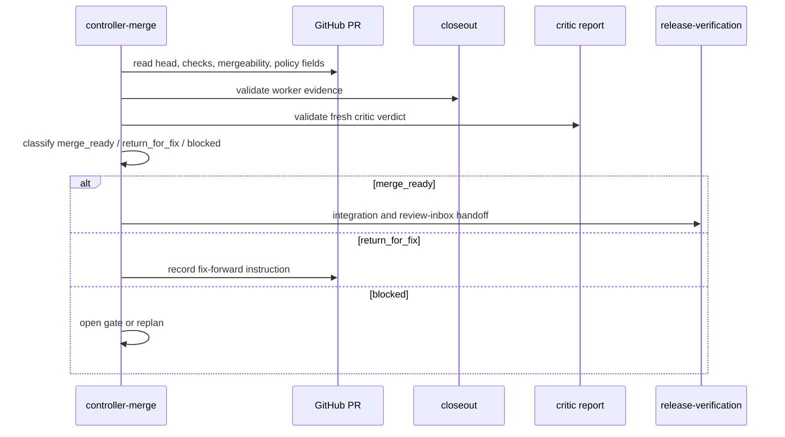

# controller-merge

**Lifecycle order:** 20 · **Modes:** `reconcile`, `merge-ready`, `return-for-fix`, `integration-handoff` · **Owns schemas:** — (uses closeout, critic, and review-inbox artifacts)

> Reconcile completed lane branches after closeout and fresh criticism, then
> prepare either merge/integration or fix-forward.

## Purpose

`controller-merge` is the controller-owned merge decision surface. It compares
the GitHub issue, lane contract, PR, branch head, closeout, critic report, check
rollup, and review packet. It records whether the lane is merge-ready,
return-for-fix, or blocked, without acting as the critic or deployment verifier.

## When to use / when not

- **Use** after worker closeout and fresh critic review when a controller needs
  to reconcile PR evidence before integration or human review.
- **Not** for reviewing code in place of `independent-critic`, dispatching
  workers, bypassing checks, merging protected release branches without policy,
  or verifying runtime deployment.

## Position in the loop

Runs after `independent-critic` and before `release-verification` integration.
It can return work to `lane-delivery` fix-forward when evidence is stale or the
critic requests changes.

## Modes

| Mode | What it does |
|---|---|
| `reconcile` | Compare issue, contract, PR, branch, closeout, critic, checks, and review packet. |
| `merge-ready` | Record the exact merge-ready handoff and target branch when evidence is current. |
| `return-for-fix` | Generate a bounded fix-forward instruction for one sequential worker. |
| `integration-handoff` | Hand merge-ready evidence to release-verification and human review. |

## Inputs (consumed)

| Input | Source |
|---|---|
| PR metadata, checks, mergeability | GitHub |
| Lane closeout | `.agent-workflow/sprints/**/lanes/closeout/*.yaml` |
| Critic report | `.agent-workflow/sprints/**/critic/*.yaml` |
| Review packet | `.agent-workflow/sprints/**/review/review-inbox-packet.yaml` |
| Reconciliation checklist | `skills/controller-merge/references/reconcile-and-merge.md` |

## Outputs (produced)

| Output | Schema | Consumed by |
|---|---|---|
| Merge/fix decision summary | Markdown / PR comment | controller, human review |
| Fix-forward instruction | lane contract scoped | `subagent-worktree`, `lane-delivery` |
| Integration handoff | review packet update | `release-verification` |

## Sequence

## Gates & stop conditions

Stop for missing critic evidence, stale PR head, implementation-check failures,
merge conflicts, protected decisions, release/deployment approval, or shared
registration conflicts that cannot be reconciled mechanically.

## Tools used

- GitHub PR/check/mergeability surfaces
- `bin/verdify artifact validate`
- `git diff`, `git merge-tree`, or equivalent non-destructive reconciliation

## Handoffs

- **Upstream:** `independent-critic`, `sprint-orchestrator`, `controller-loop`.
- **Downstream:** `release-verification`, or fix-forward through
  `subagent-worktree` and `lane-delivery`.

## References

- `skills/controller-merge/SKILL.md`
- `references/reconcile-and-merge.md`
