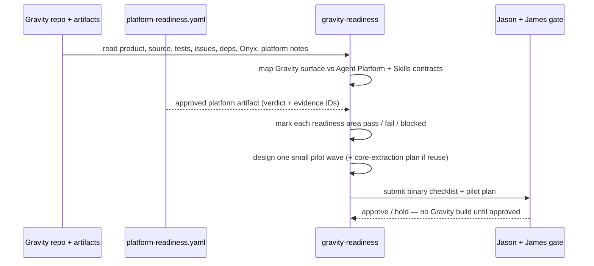

# gravity-readiness

**Lifecycle order:** 16 · **Modes:** `inventory`, `readiness-checklist`, `pilot-design` · **Owns schemas:** `gravity-readiness`, `gravity-core-extraction-plan`

> Gate Gravity implementation by inventorying the product, source, dependencies, Onyx status, environments, and platform integration — then design a pilot. Never build Gravity features from here.

## Purpose

Keeps Gravity **gated**. This skill inventories Gravity product, architecture,
source, tests, issues, and dependencies; confirms Onyx status, environments,
credentials, observability, and Agent Platform integration; reconciles all of it
against Agent Platform and Skills contracts; and designs one small pilot. It
produces a binary readiness checklist and an optional reuse-extraction plan — it
**NEVER implements Gravity features**, creates feature lane worktrees, or mutates
production/stage resources.

## When to use / when not

- **Use** when preparing Gravity for an autonomous pilot, or reconciling Gravity
  against Agent Platform and Skills readiness.
- **Not** for Gravity feature implementation. Feature work belongs to the normal
  lifecycle (`sprint-planning` → `lane-delivery`) and only after the checklist and
  pilot plan are approved.

## Position in the loop

A **readiness gate**, not an execution step. Per
[ADR-0013](../../decisions/ADR-0013-platform-vs-gravity-readiness-boundary.md),
`platform-readiness` owns shared environment and control-plane readiness;
gravity-readiness consumes that approved artifact and gates Gravity-specific
readiness on top of it. Gravity implementation stays **blocked until both
`platform-readiness` AND `gravity-readiness` pass** and Jason + James approve.

## Modes

| Mode | What it does |
|---|---|
| `inventory` | Read Gravity docs, source, tests, issues, architecture, dependencies, Onyx status, and platform integration; map Gravity's product/service surface against Agent Platform and Skills contracts. |
| `readiness-checklist` | Mark each required readiness area `pass` / `fail` / `blocked` per `references/readiness-checklist.md`, applying the platform-readiness precondition for platform-dependent areas. |
| `pilot-design` | Propose one small pilot wave that proves the whole lifecycle; when Sunshine-derived reuse is in scope, produce a `gravity-core-extraction-plan.yaml`. |

## Inputs (consumed)

| Input | Source | From |
|---|---|---|
| Gravity product, architecture, source, tests, issues, dependencies | Gravity repository + docs | upstream / repo |
| Onyx foundation status | Gravity + platform notes | inventory |
| Environments, credentials, observability | `platform-readiness.yaml`, `observability-diagnostic-packet.yaml` | `platform-readiness` |
| Platform integration evidence | `environment-gitops-reconciliation.yaml`, `bin/verdify lane inspect` | `platform-readiness` |
| Pilot + reuse criteria | `references/readiness-checklist.md`, `references/gravity-core-extraction.md` | skill references |

## Outputs (produced)

| Output | Schema | Consumed by |
|---|---|---|
| `.agent-workflow/gravity/gravity-readiness.yaml` (+ `gravity-readiness.md` report) | `gravity-readiness.schema.yaml` | Jason + James approval gate, dashboards |
| `.agent-workflow/gravity/gravity-core-extraction-plan.yaml` *(when reuse in scope)* | `gravity-core-extraction-plan.schema.yaml` | `architecture-contracts`, pilot planning |

The extraction plan carries the **Sunshine reuse matrix** (source objects →
`gravity_core` / `client_pack` / `adapter` / `docs` / `discard` / `unknown`), the
**generic-core vs pack boundary**, and **local-filesystem ingestion pilot criteria**.

## Sequence

## Gates & stop conditions

- Every readiness item is **binary**: `pass` (inspected evidence proves it),
  `fail` (evidence contradicts or is missing), `blocked` (evidence cannot be
  inspected). Never convert a `fail` to `pass` with a narrative promise — raise
  issues, gates, or platform-readiness work instead.
- **Do not implement Gravity features**, create Gravity feature lane worktrees,
  mutate production/stage resources, or bypass the checklist.
- The **first pilot is scoped to local filesystem evidence ingestion**, small
  enough to review in one human session, with preview/dev, rollback, and
  observability evidence.
- **Stop** until Jason and James approve the checklist and pilot plan.

## Tools used

- **CLI:** `bin/verdify lane inspect --repo <repo> --lease-id <id>` for lane
  mechanics; `kubectl` (or supplied snapshots) for credential, RBAC, namespace,
  and quota evidence — see [tools-and-mcp](../tools-and-mcp.md).
- **Artifacts:** reads `platform-readiness.yaml`, `observability-diagnostic-packet.yaml`,
  and `environment-gitops-reconciliation.yaml` from `platform-readiness`.
- **GitHub:** read Gravity issues, PRs, and check state for reconciliation.

## Handoffs

- **Upstream:** [`platform-readiness`](./platform-readiness.md) — supplies the
  approved `platform-readiness.yaml` and domain verdicts; gravity-readiness routes
  platform gaps back there rather than duplicating remediation.
- **Downstream:** the **Jason + James approval gate** before any Gravity pilot
  execution; the extraction plan feeds `architecture-contracts` when implementation
  is later authorized.

## References

- `skills/gravity-readiness/SKILL.md`, `references/readiness-checklist.md`,
  `references/gravity-core-extraction.md`
- [ADR-0013](../../decisions/ADR-0013-platform-vs-gravity-readiness-boundary.md)
- [schemas-catalog](../schemas-catalog.md) · [tools-and-mcp](../tools-and-mcp.md)
