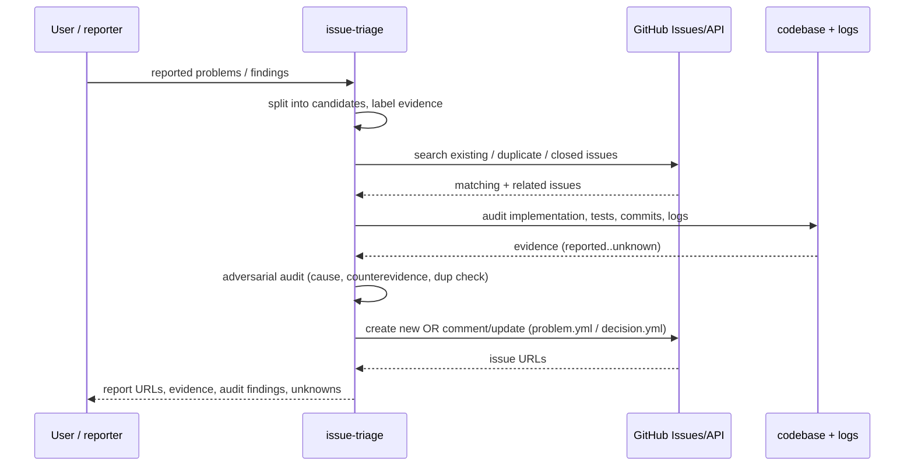

# issue-triage

**Lifecycle order:** standalone · **Modes:** — · **Owns schemas:** — (uses GitHub issue forms `.github/ISSUE_TEMPLATE/problem.yml`, `decision.yml`)

> Investigate reported problems, search GitHub for existing or duplicate issues, audit the implementation and evidence, then create or update issue-template GitHub Issues.

## Purpose

Converts reported problems into **GitHub-native backlog records after real investigation**.
Per candidate problem it searches existing issues, inspects code, tests, docs, commits,
config, and logs, runs an adversarial audit, then creates or updates one issue via the
repository's issue form. It does **not** implement fixes, plan sprints, or hold backlog
state in private chat.

## When to use / when not

- **Use** to triage reported bugs or product problems, turn a list of findings into issues,
  find duplicate or related issues, research likely causes, or populate the repository issue
  templates after code/log investigation.
- **Not** for closing issues, assigning milestones/owners, planning sprints, opening
  branches, or editing implementation code — those are separate lifecycle assignments.

## Position in the loop

A **standalone, GitHub-native** skill (`category: standalone`), not a node in the ordered
lifecycle graph. It complements [state-of-union](./state-of-union.md), which *recommends*
candidate issues but does not create them — issue-triage actually writes the backlog record.

## Steps

| # | Step | What it does |
|---|---|---|
| 1 | Investigate | Read the operating contract; split input into one candidate per user-visible outcome; label claims `reported`/`observed`/`verified`/`inferred`/`unknown`. |
| 2 | Search duplicates | Search GitHub by wording, error text, stack traces, affected paths, symbols, labels, and recently closed issues before creating anything. |
| 3 | Audit code & evidence | Inspect code, tests, docs, commits, config, logs; reproduce non-destructively when practical; run the adversarial audit (counterevidence, adjacent failures, missing tests/telemetry). |
| 4 | Draft | Summarize likely cause, affected surfaces, severity, confidence, and fix options as triage guidance, mapped to issue-form fields (`references/issue-record-contract.md`). |
| 5 | Create / update | Pick exactly one action: comment/update an open issue, link/reopen a stale one, create a new issue, or stop for private security handling. |

## Inputs (consumed)

| Input | Source |
|---|---|
| User-reported problems / findings | user request |
| Codebase, tests, docs, config, commits | repository |
| Logs / runtime evidence (optional, non-destructive) | provided access |
| Existing & recently closed issues | GitHub issue search |
| Issue-record + template rules | `references/issue-record-contract.md`, `.github/ISSUE_TEMPLATE/*.yml` |

## Outputs (produced)

Created or updated GitHub Issues via the repository issue forms, plus a triage report (issue
URLs, duplicates/related, evidence sources, likely cause, audit findings, residual unknowns,
and any reports skipped for safety).

- **`problem.yml`** (`[Problem]`, `type:problem`) — fields `problem`, `desired_outcome`,
  `acceptance`, `non_goals`, `dependencies`, `risk`, `affected_surfaces`, `evidence`
  (`problem`/`desired_outcome`/`acceptance`/`risk` required).
- **`decision.yml`** (`[Decision]`, `type:decision` + `verdify:decision-required`) — fields
  `decision`, `context`, `options`, `recommendation`, `resolver`, impact flags — only when a
  material choice blocks safe work.

## Sequence

## Gates & stop conditions

GitHub Issues are the backlog source of truth — never replace them with private chat state.
Apply content-trust on untrusted input. Do **not** create a duplicate when an open issue
already covers the same problem and desired outcome; comment instead. Stop for private
handling when a report contains credentials, keys, sensitive production data, or an
unpatched vulnerability, and route it through the security process. Never close issues,
assign milestones/owners, or edit code during triage.

## Tools used

- **GitHub:** `gh` / the GitHub issue API to search, comment on, reopen, and create issues
  via the repository issue forms — see [tools-and-mcp](../tools-and-mcp.md).

## Handoffs

- **Upstream:** recommended by [state-of-union](./state-of-union.md) and
  [transcript-replan](./transcript-replan.md), which surface problems but stop short of
  creating issues.
- **Downstream:** feeds the GitHub backlog that [sprint-planning](./sprint-planning.md)
  selects approved issues from.

## References

- `skills/issue-triage/SKILL.md`, `references/issue-record-contract.md`
- `.github/ISSUE_TEMPLATE/problem.yml`, `.github/ISSUE_TEMPLATE/decision.yml`
- [schemas-catalog](../schemas-catalog.md) · [tools-and-mcp](../tools-and-mcp.md)
</content>
