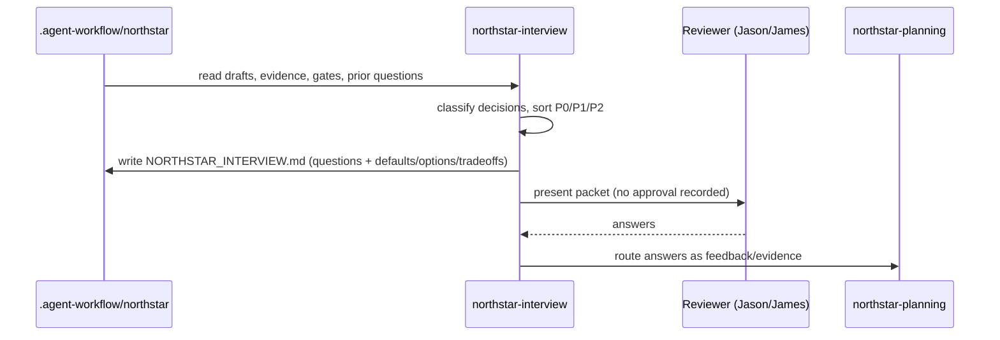

# northstar-interview

**Lifecycle order:** 6 · **Modes:** `review`, `question-pack`, `answer-capture`, `feedback-routing` · **Owns schemas:** —

> Review North Star drafts, evidence, gates, and prior questions to produce a prioritized interview packet — never to approve the North Star.

## Purpose

Produces a focused, durable interview/Q&A packet that helps humans refine a North
Star **before** final lock approval. It reads the current product and architecture
drafts, registered evidence, review packets, gates, and prior questions, then writes
evidence-linked questions with proposed defaults, options, and tradeoffs. It does not
approve the North Star, start implementation, or rewrite protected artifacts from
inferred answers.

## When to use / when not

- **Use** when Codex must question Jason, James, or other reviewers before locking or
  revising a North Star, after new evidence is ingested, when priorities are unclear,
  or when a planning loop needs interview-ready questions rather than artifact edits.
- **Not** for synthesizing answers into drafts, recording approval, or committing
  inferred answers as requirements — those belong to [northstar-planning](./northstar-planning.md)
  and the human lock gate.

## Position in the loop

Sits inside the **North Star planning loop**, between evidence intake and synthesis.
It consumes [northstar-research-ingest](./northstar-research-ingest.md) output and
[northstar-planning](./northstar-planning.md) drafts, and hands answered questions back
to planning. Ordinary questions stay nonblocking; only the final lock approval gates
the next milestone.

## Modes

| Mode | What it does |
|---|---|
| `review` | Read drafts, evidence registry, gates, and prior questions; label decisions `must-decide` / `should-decide` / `can-defer` / `research-needed`. |
| `question-pack` | Write/refresh `NORTHSTAR_INTERVIEW.md` from the template; sort questions `P0`/`P1`/`P2` per `references/question-rubric.md`. |
| `answer-capture` | Define answer-capture rules that preserve human answers as feedback/evidence. |
| `feedback-routing` | Route accepted answers back to planning; never record the lock itself. |

## Inputs (consumed)

| Input | Source | From |
|---|---|---|
| Review-ready North Star drafts | `NORTHSTAR_PRODUCT.md`, `NORTHSTAR_ARCHITECTURE.md`, `northstar-artifacts.yaml`, `northstar-plan.yaml`, `REVIEW_PLAN.md` | `northstar-planning` |
| Registered evidence | `.agent-workflow/northstar/evidence-registry.yaml` + collateral | `northstar-research-ingest` |
| Open gates | `.agent-workflow/gates/northstar.yaml` | gate state |
| Prior questions | earlier `NORTHSTAR_INTERVIEW.md` | self (prior loop) |

## Outputs (produced)

| Output | Form | Consumed by |
|---|---|---|
| `.agent-workflow/northstar/NORTHSTAR_INTERVIEW.md` | markdown packet (see [schemas-catalog](../schemas-catalog.md) — this is a packet, not a schema'd artifact) | reviewers, `northstar-planning` |

The packet carries prioritized questions, proposed defaults, options, tradeoffs,
affected North Star IDs, evidence references, answer shapes, and answer-capture rules.
It **records no approval** — proposed edits to protected artifacts are applied only when
the user explicitly asks.

## Sequence

## Gates & stop conditions

Stop before recording approval, changing protected North Star content, or turning an
inferred answer into a committed requirement. The skill **does not self-approve the
lock**; final lock approval is recorded separately by `northstar-planning`. If the
interview reveals unsafe access, production mutation, raw secrets, or destructive
changes, record a gate or protected decision instead.

## Tools used

- **Filesystem:** read `.agent-workflow/northstar/*` drafts, evidence registry, and
  gates; write the interview packet from `assets/NORTHSTAR_INTERVIEW.template.md`. No
  destructive, MCP, or production tools — see [tools-and-mcp](../tools-and-mcp.md).

## Handoffs

- **Upstream:** [northstar-planning](./northstar-planning.md) (review-ready drafts) and
  [northstar-research-ingest](./northstar-research-ingest.md) (newly registered evidence).
- **Downstream:** [northstar-planning](./northstar-planning.md) `review-feedback` /
  `artifact-loop` — receives answered questions as feedback/evidence for synthesis and
  the eventual lock decision.

## References

- `skills/northstar-interview/SKILL.md`, `references/question-rubric.md`,
  `assets/NORTHSTAR_INTERVIEW.template.md`
- `../../COMMON_OPERATING_CONTRACT.md`
