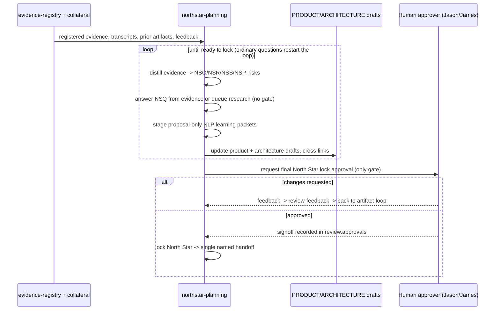

# North Star Planning

**Lifecycle order:** 5 · **Modes:** `intake`, `synthesis`, `artifact-loop`, `research-loop`, `adversarial-review`, `decision-pack`, `learning-capture`, `human-review`, `review-feedback`, `signoff` · **Owns schemas:** `northstar-plan`, `northstar-artifacts`, `northstar-learning-proposals`

> Run the self-improving North Star loop: distill registered evidence, answer or queue questions, propose research, stage proposal-only learning, iterate the product/architecture drafts, and request human approval only to lock the North Star.

## Purpose

Converts messy planning input into explicit, evidence-backed **product** and
**architecture** North Star artifacts — kept separate but cross-linked. Answers
what the repo and research can answer, queues research where evidence is thin,
captures validated lessons as proposal-only improvements, and iterates until the
artifacts are ready for a single final human lock.

## When to use / when not

- **Use** after [`transcript-replan`](./transcript-replan.md) or
  [`northstar-research-ingest`](./northstar-research-ingest.md), to ingest context,
  kick off or continue the loop, handle feedback, or before
  [`project-definition`](./project-definition.md),
  [`architecture-contracts`](./architecture-contracts.md), sprint/CI-CD wave
  planning, or any protected `DESIGN_COMMITTED` change.
- **Not** for locking the North Star without configured human approval, for
  applying skill/hook/tool/config/source changes (proposal-only), or for
  downstream implementation.

## Position in the loop

The **PLAN** foundation: after evidence intake, before definition and architecture
work. Downstream skills may *read* the drafts but must treat them as draft
planning input until the final lock is recorded.

## Modes

| Mode | What it does |
|---|---|
| `intake` | Gather and classify sources as evidence, not conclusions. |
| `synthesis` | Create product, requirement, story, milestone, architecture-input, and risk records. |
| `artifact-loop` | Update the product/architecture docs, answer or queue `NSQ-*`, propose research, cross-link evidence, maintain review state. |
| `research-loop` | Identify missing evidence, ingest or request research, rerun synthesis. |
| `adversarial-review` | Attach multi-lens findings with required dispositions. |
| `decision-pack` | Produce proposed artifact changes, issues, and design options for the next loop. |
| `learning-capture` | Classify validated lessons into **proposal-only** `NLP-*` packets; never applies protected changes. |
| `human-review` | Present ready artifacts, remaining judgment calls, and the review script. |
| `review-feedback` | Incorporate feedback and route back to `artifact-loop`. |
| `signoff` | Record the configured final approval and lock the North Star for the next milestone. |

## Inputs (consumed)

| Input | Schema / source | From |
|---|---|---|
| Registered research evidence | `evidence-registry.yaml` (`northstar://evidence/<id>`) | `northstar-research-ingest` |
| Routed transcripts / planning extracts | source evidence records | `transcript-replan` |
| Existing North Star + project artifacts | `northstar-artifacts`/`northstar-plan`, `project-definition`, ADRs | self (recovery) / upstream |
| Human review feedback | `review.status`, `NSQ-*` | human approver (Jason/James) |

## Outputs (produced)

| Output | Schema | Consumed by |
|---|---|---|
| `.agent-workflow/northstar/NORTHSTAR_PRODUCT.md` | markdown product authority | `project-definition`, `state-of-union` |
| `.agent-workflow/northstar/NORTHSTAR_ARCHITECTURE.md` | markdown architecture authority | `architecture-contracts` |
| `.agent-workflow/northstar/northstar-artifacts.yaml` | `northstar-artifacts.schema.yaml` | loop state, review, signoff |
| `.agent-workflow/northstar/northstar-plan.yaml` | `northstar-plan.schema.yaml` | structured synthesis / index |
| `.agent-workflow/northstar/learning-capture/*.yaml` | `northstar-learning-proposals.schema.yaml` | proposal review (**proposal-only**) |

## Sequence

## Gates & stop conditions

- **Ordinary planning questions never open a gate.** Unresolved `NSQ-*`
  (`blocking: false`) keep the loop in `iterating`: answer from evidence, queue
  research, draft options, or narrow choices.
- **The only planning gate is the final lock** — set `status: approved` only after
  required human signoff is recorded in `review.approvals`.
- **Learning capture is proposal-first** — it may scan, redact, classify, and stage
  `NLP-*` packets, but never applies skill/hook/command/tool/config/source or
  protected-artifact changes without the configured approval path.
- Otherwise stop only for unsafe access, protected production mutation, raw
  secrets, destructive actions, or a protected-file edit lacking its approval rule.

## Tools used

- **CLI:** [`bin/verdify route`](../tools-and-mcp.md) for lifecycle position;
  validate YAML against the three owned schemas; render from `assets/*.template.*`.
- **GitHub:** read issues, PRs, and gates for *proposed* issue/gate recommendations only.

## Handoffs

- **Upstream:** [`transcript-replan`](./transcript-replan.md),
  [`northstar-research-ingest`](./northstar-research-ingest.md) (routed evidence,
  ingested research).
- **Downstream (only after final lock):** name exactly one next skill + mode —
  [`project-definition`](./project-definition.md) (missing/contradictory product
  intent), [`architecture-contracts`](./architecture-contracts.md) (decision areas
  ready but unapproved), [`state-of-union`](./state-of-union.md) (backlog
  sequencing), `repo-hygiene`, `platform-readiness`, or `gravity-readiness`.

## References

- `skills/northstar-planning/SKILL.md`, `references/planning-contract.md`,
  `references/artifact-loop.md`, `references/learning-capture.md`
- [Schemas catalog](../schemas-catalog.md) · [Tools & MCP](../tools-and-mcp.md)
