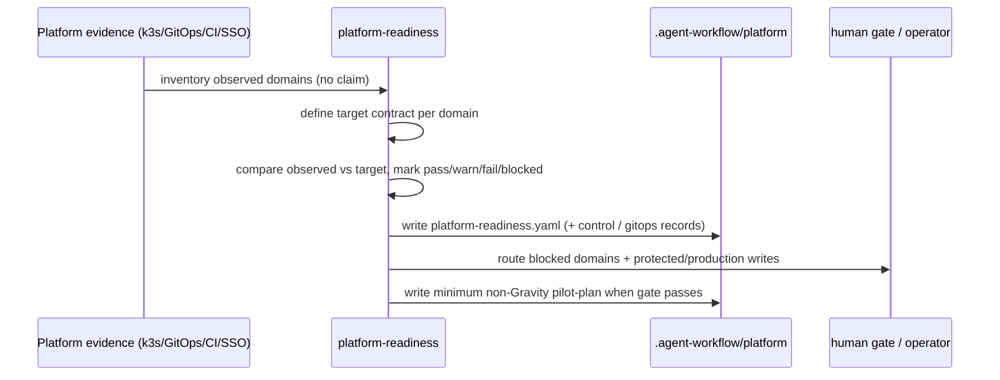

# platform-readiness

**Lifecycle order:** 15 · **Modes:** `inventory`, `target-contract`, `readiness-gate`, `pilot-plan` · **Owns schemas:** `platform-readiness`, `agent-platform-control-request`, `environment-gitops-reconciliation`

> Inventory and gate Agent Platform and environment readiness across Kubernetes, RBAC, secrets, CI/CD, GitOps, edge, SSO, observability, terminals, and review UX before autonomous execution.

## Purpose

Prove the delivery platform **before** using it on Gravity or any autonomous
lifecycle run. It inventories observed platform evidence, defines a target
readiness contract, and gates whether the control plane can safely support
autonomous execution. **Inventory and design only** — it never applies
production changes, copies secrets, or runs the operations it documents.

## When to use / when not

- **Use** before autonomous platform execution, before a Gravity pilot, or when
  environment and control-plane readiness is uncertain.
- **Not** for Gravity feature work (that is `gravity-readiness` then delivery),
  for executing platform mutations (a separate approved operator does that), or
  for sprint dispatch (`sprint-orchestrator`).

## Position in the loop

A **cross-cutting readiness gate** before EXECUTE. It owns no single lifecycle
transition; it certifies that the platform on which `controller-loop` and
`sprint-orchestrator` will run is real and safe, then hands a proven control
plane to `gravity-readiness` for the Gravity-specific pilot.

## Modes

| Mode | What it does |
|---|---|
| `inventory` | Collect observed Agent Platform, k3s, GitOps, CI/CD, credential, edge, SSO, observability, terminal, and review evidence — no readiness claimed. |
| `target-contract` | Define per-domain targets, required evidence sources, owners, and non-Gravity pilot entry/exit criteria. |
| `readiness-gate` | Mark each domain `pass`/`warn`/`fail`/`blocked`, set overall `ready`/`not_ready`/`blocked`, and route blockers to gates. |
| `pilot-plan` | Define the minimum non-Gravity pilot that proves the platform end to end before a Gravity pilot is approved. |

## Inputs (consumed)

| Input | Source |
|---|---|
| Kubernetes namespaces, quotas, placement, service accounts, PVCs, and RBAC / dev-stage-prod boundaries | k3s / GitOps snapshots, SubjectAccessReview |
| Secrets & credential injection — **location inventory only** | credential-reference inventory (no raw secrets) |
| CI/CD, image build, registry, cache, Argo CD/GitOps flow | GitHub + CI state, GitOps manifests |
| Ingress, DNS, TLS, k3s Traefik edge, route health; Authentik SSO boundary, callbacks, group/role mapping | edge + SSO authentication evidence |
| Observability (metrics/logs/traces/dashboards/SLOs/markers), browser terminals, combined review inbox UX | observability docs, platform session evidence |
| Agent Platform project/session API or MCP contracts | Agent Platform contracts, ADR-0013 |

## Outputs (produced)

| Output | Schema | Notes |
|---|---|---|
| `.agent-workflow/platform/platform-readiness.yaml` | [`platform-readiness.schema.yaml`](../schemas-catalog.md) | Per-domain readiness matrix + overall verdict; `.md` human report alongside. |
| `.agent-workflow/platform/agent-platform-control-request.yaml` | [`agent-platform-control-request.schema.yaml`](../schemas-catalog.md) | **Proposed** for any MCP/API op — records authorization, policy, target, result, review. Does not execute. |
| `.agent-workflow/platform/environment-gitops-reconciliation.yaml` | [`environment-gitops-reconciliation.schema.yaml`](../schemas-catalog.md) | Desired vs observed state, controller sync/health, namespace controls, drift, rollback. |
| `platform-readiness.md` report + proposed ADRs/issues/gates | — | One per blocked or unowned platform gap. |

## Sequence

## Gates & stop conditions

Blocks unsafe autonomous work: no readiness `pass` without inspected evidence.
Stop before production edge changes, secrets copying, broad RBAC grants,
unreviewed namespace writes outside development, or Gravity implementation.
Credential discovery is **reference-only** — record where credentials live, never
raw tokens, keys, or payloads. Protected/production control requests cannot reach
`authorized`/`executing`/`complete` without an approved human review.

## Tools used

- **CLI:** `bin/verdify` routing helpers; schema validation against `schemas/*.schema.yaml`.
- **MCP/API:** Agent Platform project/session contracts are *documented and
  proposed* via `agent-platform-control-request`, never invoked here — see
  [tools-and-mcp](../tools-and-mcp.md).
- **Read-only evidence:** GitHub issue/PR/check/deployment + CI state; k3s, Argo
  CD/Flux, namespace, and edge state.

## Handoffs

- **Upstream:** [`repo-hygiene`](./repo-hygiene.md) (repo meets operating standard
  before platform certification).
- **Downstream:** a proven platform enables [`sprint-orchestrator`](./sprint-orchestrator.md)
  and [`controller-loop`](./controller-loop.md) for autonomous execution, and
  [`gravity-readiness`](./gravity-readiness.md) for the Gravity-specific pilot.

## References

- `skills/platform-readiness/SKILL.md`, `references/readiness-domains.md`,
  `references/agent-platform-control.md`, `references/environment-gitops.md`
- [schemas-catalog](../schemas-catalog.md) · [tools-and-mcp](../tools-and-mcp.md)
