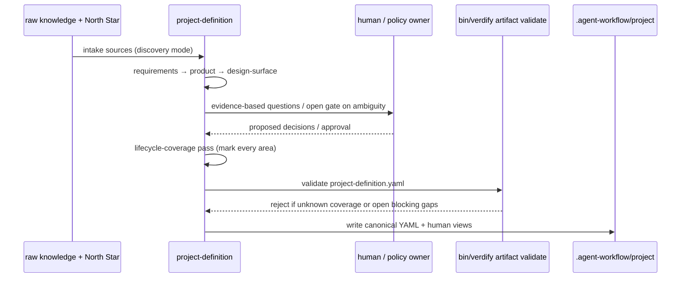

# project-definition

**Lifecycle order:** 8 · **Modes:** `discovery`, `requirements`, `product`, `design-surface` · **Owns schemas:** `project-definition`

> Convert raw project knowledge into one approved, traceable end-to-end project definition before anyone designs architecture, plans sprints, or writes code.

## Purpose

Owns the **foundation contract**. Through four ordered modes plus a final
lifecycle-coverage pass, it turns scattered sources into one canonical definition of
intent, requirements, product scope, design surfaces, lifecycle coverage,
architecture-significant constraints, relationships, and traceability — the
obligations every later lifecycle role must satisfy.

## When to use / when not

- **Use** for new or poorly understood projects, after a major product or technical
  direction change, or whenever requirements, users, scope, data, hosting,
  deployment, operations, integrations, ownership, flows, interfaces, or approval
  points are missing or contradictory.
- **Not** for choosing components, modules, vendors, or frameworks (that is
  `architecture-contracts`), nor for selecting issues into a sprint
  (`sprint-planning`). It captures what architecture must solve, not the design.

## Position in the loop

The entry point of **DEFINE**. It consumes a locked North Star when one exists and
hands an approved definition to `architecture-contracts`; its approved artifact also
feeds `state-of-union`. Do not jump from raw notes straight to architecture or
implementation — those roles depend on this artifact's coverage and gates.

## Modes

| Mode | What it does |
|---|---|
| `discovery` | Intake every source, then ask only evidence-based gap questions (`references/discovery-mode.md`). |
| `requirements` | Convert approved discovery into uniquely identified, testable FRs/NFRs with acceptance criteria (`references/requirements-mode.md`). |
| `product` | Define users, problem, jobs, minimum useful scope, non-goals, metrics, rollout/support (`references/product-mode.md`). |
| `design-surface` | Define every intentional surface — UI, CLI, API, event, MCP/tool, agent, admin, review, approval (`references/design-surface-mode.md`). |

A final lifecycle-coverage pass (`references/lifecycle-coverage.md`) runs before
approval; it is a pass, not a selectable mode.

## Inputs (consumed)

| Input | Schema / source | From |
|---|---|---|
| Raw project knowledge | repo docs, transcripts, notes, research, issues, specs, screenshots, spreadsheets | supplied sources |
| Locked North Star (when present) | `NORTHSTAR_PRODUCT.md`, `NORTHSTAR_ARCHITECTURE.md`, `northstar-artifacts.yaml` | `northstar-planning` |
| Evidence, prior outputs, human answers | direct evidence vs reported context vs inference | sources / self / human gate |
| Mode + quality rules | `references/*.md`, `traceability.md` | skill references |

## Outputs (produced)

| Output | Schema | Consumed by |
|---|---|---|
| `.agent-workflow/project/project-definition.yaml` | `project-definition.schema.yaml` | `architecture-contracts`, `state-of-union` |
| Human views: `discovery.md`, `requirements.md`, `product.md`, `design-surface.md`, `lifecycle-readiness.md` | generated from the YAML | reviewers, approval owners |

The YAML is canonical; Markdown views summarize it and introduce no new decisions.
The definition must record every required lifecycle-coverage area, and a **semantic
validator rejects an approved definition that still has any `unknown` coverage or any
open blocking gap**.

## Sequence

## Gates & stop conditions

Open a durable gate instead of proceeding when primary users, problem, scope, public
behavior, data handling, security/privacy/compliance, infrastructure or hosting,
deployment/rollback, operational ownership, external relationships, approval
authority, or success criteria remain materially unresolved. A material `unknown`
coverage area or any open blocking gap blocks approval. No sprint lanes are created
here.

## Tools used

- **CLI:** `bin/verdify artifact validate --file .agent-workflow/project/project-definition.yaml`
  (schema + semantic checks) — see [tools-and-mcp](../tools-and-mcp.md).

## Handoffs

- **Upstream:** `northstar-planning` (locked North Star, when present) and the raw
  project sources supplied for the repo.
- **Downstream:** [architecture-contracts](./architecture-contracts.md) receives the
  approved definition and views; [state-of-union](./state-of-union.md) consumes it to
  reconcile backlog against intent.

## References

- `skills/project-definition/SKILL.md`, `references/discovery-mode.md`,
  `references/requirements-mode.md`, `references/product-mode.md`,
  `references/design-surface-mode.md`, `references/lifecycle-coverage.md`,
  `references/traceability.md`
- [schemas-catalog](../schemas-catalog.md) · [tools-and-mcp](../tools-and-mcp.md)
