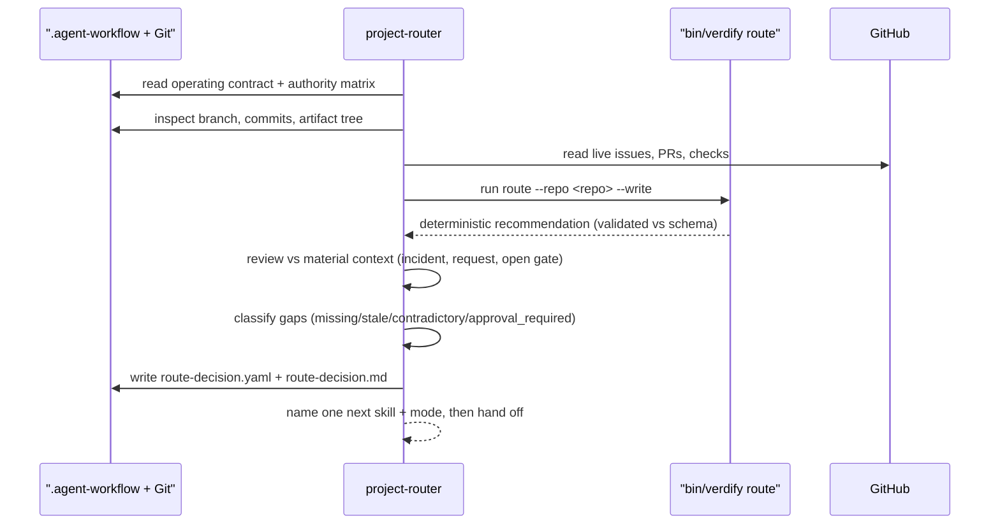

# project-router

**Lifecycle order:** 1 · **Modes:** `route`, `resume`, `gap-detection` · **Owns schemas:** `route-decision`

> Determine the next Verdify lifecycle skill and mode by inspecting repository, GitHub, and approved `.agent-workflow` state.

## Purpose

Decide **exactly one** next lifecycle action without doing that action's substantive
work. The router reconstructs lifecycle position from durable artifacts plus live Git
and GitHub state, names one next skill and one mode, and records the decision so any
session can resume from artifacts rather than chat history.

## When to use / when not

- **Use** when starting or resuming a project, after a handoff, after sprint closure,
  or whenever lifecycle position and missing prerequisites are unclear.
- **Not** for performing the routed-to work. The router never implements, plans,
  reviews, or merges; it hands off. `issue-triage` is standalone and is not routed here.

## Position in the loop

The **entrypoint** of the lifecycle (`config/lifecycle.yaml` `entrypoint: project-router`).
It is a derived decision procedure over that canonical model. `repo-hygiene`,
`controller-loop`, `platform-readiness`, and `gravity-readiness` are reached only
through approved state-of-union handoffs or open gates, not from local file absence.

## Modes

| Mode | What it does |
|---|---|
| `route` | Determine one next skill and mode from current repo, GitHub, and approved-artifact state. |
| `resume` | Re-derive lifecycle position after a handoff, restart, or sprint closure and point to the next role. |
| `gap-detection` | Classify missing information as `missing`, `stale`, `contradictory`, or `approval_required` and route to the owning skill. |

## Inputs (consumed)

| Input | Schema / source | From |
|---|---|---|
| Operating contract + authority resolution | `COMMON_OPERATING_CONTRACT.md`, `config/authority-matrix.yaml` | repo policy |
| Canonical lifecycle model | `config/lifecycle.yaml` | repo config |
| Repository state | branch, clean/dirty, commits, `.agent-workflow` tree | Git |
| Backlog + delivery state | issues, PRs, checks | GitHub control plane |
| Approved phase artifacts | `project-definition`, `architecture`, `module-contract`, `sprint-plan`, `human-gate` | upstream lifecycle |
| Precedence + readiness rules | `references/routing-rules.md`, `references/artifact-readiness.md` | skill references |

## Outputs (produced)

| Output | Schema | Consumed by |
|---|---|---|
| `.agent-workflow/router/route-decision.yaml` | `route-decision.schema.yaml` | the named next skill, controller-loop, recovery |
| `.agent-workflow/router/route-decision.md` | derived Markdown view | human/operator |

## Sequence

## Gates & stop conditions

Stop and report rather than guess when repository identity or default branch is
ambiguous, GitHub is unreachable and the cached snapshot is materially stale, approved
artifacts conflict with live code or GitHub state, a material gate has no authorized
resolver, or the user requests a later phase whose prerequisites are absent. Never infer
that a missing artifact was approved.

## Tools used

- **CLI:** `bin/verdify route --repo <repository> --write` (also `--json`); the generated
  decision is validated against `route-decision.schema.yaml` — see
  [tools-and-mcp](../tools-and-mcp.md).
- **GitHub:** read issue/PR/check state; live state is authoritative over cached snapshots.
- **MCP/API:** none — the router only reads state and writes the decision artifact.

## Handoffs

- **Upstream:** none — this is the lifecycle entrypoint; it is invoked at project start,
  after a handoff, or after sprint closure.
- **Downstream:** routes to exactly one next skill by first unmet condition, e.g.
  [transcript-replan](./transcript-replan.md), [northstar-research-ingest](./northstar-research-ingest.md),
  [northstar-planning](./northstar-planning.md), [project-definition](./project-definition.md),
  [architecture-contracts](./architecture-contracts.md), [state-of-union](./state-of-union.md),
  [sprint-planning](./sprint-planning.md), [sprint-orchestrator](./sprint-orchestrator.md),
  [lane-delivery](./lane-delivery.md), [independent-critic](./independent-critic.md), or
  [release-verification](./release-verification.md). It does not continue into implementation.

## References

- `skills/project-router/SKILL.md`, `references/routing-rules.md`,
  `references/artifact-readiness.md`
- Schema: `route-decision.schema.yaml` — see [schemas-catalog](../schemas-catalog.md)
