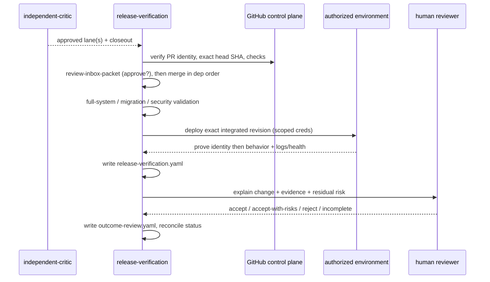

# release-verification

**Lifecycle order:** 19 · **Modes:** `review-inbox`, `observability-diagnostics`, `integration`, `deployment-verification`, `outcome-review` · **Owns schemas:** `review-inbox-packet`, `release-verification`, `outcome-review`, `observability-diagnostic-packet`

> Assemble review-ready evidence, record runtime diagnostics, integrate critic-approved lanes, prove the intended revision in an authorized environment, and close the human outcome loop.

## Purpose

Assemble a review-ready evidence packet, record observability diagnostics for
planning/review/release health, integrate critic-approved lanes and validate the
whole system, verify the intended revision in an authorized deployment
environment, and complete human outcome review. The governing principle is that
**merge is not deployment**: a merged PR is not deployment proof, a healthy
process is not acceptance proof, and outcome acceptance is a separate human
decision from either.

## When to use / when not

- **Use** after critic review, when a lane/wave claims review-ready status, when
  planning/state-of-union needs live deployment/log health evidence, after all
  required lanes are ready for integration, for deployment incidents, or when a
  merged release still needs runtime proof and acceptance.
- **Not** for implementing lane code (`lane-delivery`), reviewing a single lane
  (`independent-critic`), or making protected design decisions — and it never
  lets a worker self-deploy with production credentials.

## Position in the loop

The **REVIEW + release** stage, after `independent-critic`. Critic approval is
necessary but not sufficient: integration waits for a complete review packet with
an `approve` recommendation (or an explicit gated policy exception). Deployment
uses separately scoped, separately authorized access — never worker credentials.

## Modes

| Mode | What it does |
|---|---|
| `review-inbox` | Verify PR/MR identity and exact reviewed head SHA, gather checks/preview/telemetry/rollback evidence, score completeness, and route `approve`/`request_changes`/`reject`/`escalate`. |
| `observability-diagnostics` | Cross-mode: record runtime scope, correlation IDs, hypotheses, signal assessments, and findings when a gate depends on live evidence. |
| `integration` | Fresh integration session: revalidate critic approvals, merge in dependency order (merge queue when configured), run full-system/migration/security validation. |
| `deployment-verification` | Deploy the exact integrated revision with scoped credentials, prove identity then behavior, optionally record GitOps reconciliation, roll back or open an incident gate per policy. |
| `outcome-review` | Explain to the human what changed and what evidence proves it, record acceptance, then reconcile sprint/issue status. |

## Inputs (consumed)

| Input | Source | From |
|---|---|---|
| Critic-approved lanes, lane closeout, critic report | lane review state | `independent-critic` |
| PR/MR identity, base ref, exact reviewed head SHA | GitHub | GitHub control plane |
| Required check runs, workflow runs, security scans | checks/CI URLs | GitHub control plane |
| Preview/review deployment, environment, observed revision | deployment record | preview generator / GitOps |
| Telemetry: dashboards, logs, metrics, traces, probes | runtime links | observability stack |
| Rollback procedure, known-good revision, rollback evidence | release plan | `sprint-planning` wave plan |

## Outputs (produced)

| Output | Schema | Consumed by |
|---|---|---|
| `.agent-workflow/sprints/<sprint-id>/review/review-inbox-packet.yaml` | `review-inbox-packet.schema.yaml` | reviewers, integration gate |
| `.agent-workflow/sprints/<sprint-id>/release/observability-diagnostic-packet.yaml` | `observability-diagnostic-packet.schema.yaml` | `state-of-union`, review inbox, readiness |
| `.agent-workflow/sprints/<sprint-id>/release/release-verification.yaml` | `release-verification.schema.yaml` | outcome review, audit |
| `.agent-workflow/sprints/<sprint-id>/outcome/outcome-review.yaml` | `outcome-review.schema.yaml` | `project-router`, human sign-off |

## Sequence

## Gates & stop conditions

- **Review packet completeness** — `evidence_completeness.verdict` is `complete`
  only with PR/MR identity, exact reviewed head SHA, observed check statuses,
  required deployment evidence (or a recorded non-environment reason), executable
  human test steps, explicit telemetry, rollback readiness, and resolved critical
  security findings. Otherwise stop and route to `fix_lane`, `replan`,
  `architecture_review`, or `hold` — e.g. SHA missing/mismatched, required checks
  failing, an observed revision the preview/review deployment cannot identify, or
  unresolved preview-generator/secret controls.
- **Deployment proof separate from merge** — a merged PR is never deployment
  proof; the running revision must be identified and the verifier must be distinct
  from the deployer. Stop when the running revision cannot be identified or
  protected-environment mutation lacks approval.
- **Outcome acceptance separate** — sprint/issue status is reconciled only after a
  recorded human acceptance decision; follow-up work is never hidden in release notes.

## Tools used

- **GitHub:** PR/MR identity, check/workflow runs, deployment environments,
  releases, merge queue — see [tools-and-mcp](../tools-and-mcp.md).
- **Release/deployment:** repository release tooling and separately scoped
  deployment access (GitOps controllers — Argo CD, Flux, or a named manual one).
- **Observability:** dashboards, logs, metrics, traces, probes, and Kubernetes
  events/pod status for diagnostics and deployment verification.

## Handoffs

- **Upstream:** `independent-critic` (per-lane approval) and `sprint-orchestrator`
  (routes ready lanes/waves into the review inbox).
- **Downstream:** on accepted outcome, return to
  [`project-router`](./project-router.md) for the next lifecycle decision; route
  deployment incidents / degraded release-health through an incident gate and
  [`controller-loop`](./controller-loop.md). Diagnostic packets feed
  [`state-of-union`](./state-of-union.md) and platform readiness.

## References

- `skills/release-verification/SKILL.md`, `agents/openai.yaml`
- `references/review-inbox.md`, `references/observability-diagnostics.md`,
  `references/integration.md`, `references/deployment-verification.md`,
  `references/environment-gitops.md`, `references/rollback.md`,
  `references/outcome-review.md`
- [schemas-catalog](../schemas-catalog.md) · [tools-and-mcp](../tools-and-mcp.md)
