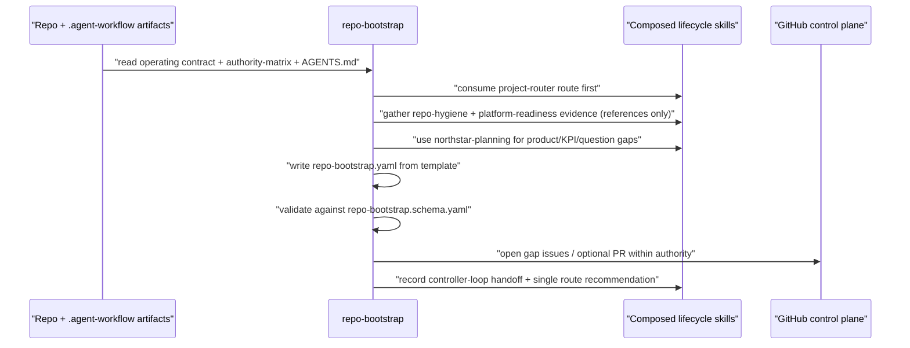

# repo-bootstrap

**Lifecycle order:** 2 · **Modes:** `self-discovery`, `packet`, `gap-backlog`, `handoff` · **Owns schemas:** `repo-bootstrap`

> Run a repository bootstrap and self-discovery facade over existing Verdify
> lifecycle skills to produce a safe bootstrap packet, `AGENTS.md` delta, gap
> backlog, KPI proposal, and route recommendation.

## Purpose

Bootstraps a repository controller **without creating a parallel lifecycle**. It
composes `project-router`, `repo-hygiene`, `platform-readiness`,
`northstar-planning`, and `controller-loop` as a facade, then emits one
schema-backed packet that can be reviewed, validated, and routed. All discovery is
**credential-safe**: it records credential references, auth modes, owners, scopes,
validation status, and failure modes only — never raw tokens, passwords, refresh
tokens, API keys, client secrets, private keys, or secret payloads.

## When to use / when not

- **Use** when a newly connected or newly assigned repo controller must inventory
  repository, GitHub, runtime, credential-reference, and planning gaps before
  normal lifecycle execution.
- **Not** for starting implementation, locking design, or replacing a more urgent
  gate. Bootstrap may *recommend* a route but must never silently run it; lane work
  belongs to `lane-delivery` and design locks to `northstar-planning` + human gate.

## Position in the loop

Early **DISCOVER/ORIENT** step. `project-router` remains the entrypoint and is
consumed first so bootstrap does not hide a more urgent gate, an unrouted
transcript, or a stale approved artifact. It ends by handing off to exactly one
next skill and mode.

## Modes

| Mode | What it does |
|---|---|
| `self-discovery` | Compose `project-router`, `repo-hygiene`, `platform-readiness`, and `northstar-planning` evidence into repo, runtime, and credential-reference inventories — references only, no raw secrets. |
| `packet` | Write `.agent-workflow/bootstrap/repo-bootstrap.yaml` from `assets/repo-bootstrap.template.yaml` and validate it against `repo-bootstrap.schema.yaml`. |
| `gap-backlog` | Emit the `AGENTS.md` delta, KPI proposal (`KPI-*`), and issue-ready gap backlog (`GAP-*`); open gap issues or a PR only within existing authority. |
| `handoff` | Record exactly one route recommendation and, when initializing a long-lived controller, the `controller-loop` session handoff. |

## Inputs (consumed)

| Input | Schema / source | From |
|---|---|---|
| Operating contract + authority matrix | `COMMON_OPERATING_CONTRACT.md`, `config/authority-matrix.yaml` | repo root |
| Current route decision | `route-decision` | `project-router` |
| Repository / Git / GitHub / CI evidence | hygiene observations | `repo-hygiene` |
| Runtime + credential-reference status | readiness observations | `platform-readiness` |
| Product / architecture / KPI / question gaps | planning synthesis | `northstar-planning` |
| Packet template + reference | `assets/repo-bootstrap.template.yaml`, `references/bootstrap-packet.md` | skill assets/references |

## Outputs (produced)

| Output | Schema | Consumed by |
|---|---|---|
| `.agent-workflow/bootstrap/repo-bootstrap.yaml` | `repo-bootstrap.schema.yaml` | review/validation, route consumers, `controller-loop` |
| `.agent-workflow/bootstrap/repo-bootstrap.md` (optional) | rendered from packet | human reviewers |
| `AGENTS.md` delta (proposed/applied/blocked) | `agents_delta` (patch_ref) | repo / GitHub control plane |
| Gap issues + optional PR | `github_outputs` | backlog, downstream lifecycle |

## Sequence

## Gates & stop conditions

Stop and open a gate before raw secret exposure, production or protected runtime
writes, broad RBAC grants, namespace or route ownership changes, storage mount
changes, destructive cleanup, or any public lifecycle contract change not already
authorized. The packet schema has **no credential value field** — secret-bearing
sources are summarized as references and marked redacted or blocked, never
checksummed or partially quoted. The five required open questions (namespace
naming, domain-agent authority, route/DNS ownership, storage mounts, runtime-image
packages) remain owner-gated.

## Tools used

- **CLI:** `bin/verdify route --write` (route recommendation), `bin/verdify
  artifact validate --file .agent-workflow/bootstrap/repo-bootstrap.yaml`
  (validate packet against its `schema_ref`), `bin/verdify github bootstrap`
  (preview/apply standard Verdify labels for gap issues).
- **MCP/API:** only **authorized** runtime/credential-reference snapshots via
  `platform-readiness` — live cluster or secret access is optional and separately
  authorized; see [tools-and-mcp](../tools-and-mcp.md).
- **GitHub:** open gap issues and at most one PR within authority; link refs in the
  packet `github_outputs`.

## Handoffs

- **Upstream:** `project-router` (route inspected first) for a newly connected or
  newly assigned repo controller.
- **Downstream:** hands off to exactly one `route_recommendation.next_skill` +
  `next_mode`; emits the durable controller/session handoff to `controller-loop`
  when a long-lived repo controller is initialized; feeds gap issues to the backlog.

## References

- `skills/repo-bootstrap/SKILL.md`, `references/bootstrap-packet.md`,
  `assets/repo-bootstrap.template.yaml`, `assets/repo-bootstrap.fixture.yaml`
- Schema: `schemas/repo-bootstrap.schema.yaml` — see [schemas catalog](../schemas-catalog.md)
- Composed skills: [project-router](./project-router.md), [repo-hygiene](./repo-hygiene.md),
  [platform-readiness](./platform-readiness.md), [northstar-planning](./northstar-planning.md),
  [controller-loop](./controller-loop.md)
