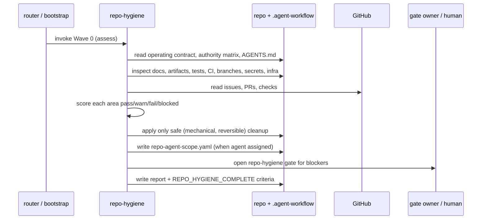

# repo-hygiene

**Lifecycle order:** 11 · **Modes:** `assess`, `safe-cleanup`, `compliance-gate` · **Owns schemas:** `repo-hygiene`, `repo-agent-scope`

> Wave 0 repository hygiene before feature execution: assess docs, source-of-truth artifacts, GitHub state, branches, tests, CI, secrets, infra, and ownership, then make the repo safe for agents.

## Purpose

The **Wave 0 compliance** pass that makes a repository safe for agents **before**
feature work begins: assess docs and source-of-truth artifacts, score each
hygiene area, apply only safe cleanup, record blockers as gates, and define the
exact `REPO_HYGIENE_COMPLETE` criteria. Nothing downstream — strategy, sprint
planning, lane dispatch — runs until the repo meets the operating standard or its
gaps are explicitly owned.

## When to use / when not

- **Use** for inherited repositories, newly connected projects, or any repo that
  must meet the Verdify operating standard before sprint planning or lane dispatch.
- **Not** for implementing features, planning sprints, or making protected design
  decisions. Ambiguous deletion, ownership, or policy changes are **escalated**.

## Position in the loop

The first gate after a repo is connected. It typically follows `repo-bootstrap`
or `project-router` and precedes `state-of-union` / `sprint-planning`; hygiene
must pass (or have approved exceptions) before any lane is dispatched.

## Modes

| Mode | What it does |
|---|---|
| `assess` | Inspect docs, `.agent-workflow`, GitHub, branches, tests, CI, secrets, infra, and ownership; score each area `pass`/`warn`/`fail`/`blocked` per `references/compliance-checklist.md`. |
| `safe-cleanup` | Apply only cleanup that is mechanical, reversible, and within policy; propose PRs or Issues for everything else. |
| `compliance-gate` | Open/update the repo hygiene gate for blockers and write the `REPO_HYGIENE_COMPLETE` criteria. |

## Inputs (consumed)

| Input | Source |
|---|---|
| Operating contract, authority matrix, repo `AGENTS.md` | `../../COMMON_OPERATING_CONTRACT.md`, `../../config/authority-matrix.yaml`, repo |
| Source-of-truth artifacts (definition, architecture, ADRs, schemas, sprint) | `.agent-workflow`, upstream lifecycle |
| GitHub state (issues, PRs, checks) | GitHub control plane / snapshot |
| Stale branches and worktrees | Git |
| Test, lint, and schema-validation commands | package metadata, repo |
| CI configuration | CI config |
| Secrets exposure (prompts, logs, source, generated artifacts, config) | repo scan |
| Infrastructure declarations (env, deployment, rollback, observability) | docs/config |
| Ownership boundaries (lane ownership, protected files, interface rules) | `AGENTS.md`, authority matrix |

## Outputs (produced)

| Output | Schema | Consumed by |
|---|---|---|
| `.agent-workflow/hygiene/repo-hygiene.yaml` | `repo-hygiene.schema.yaml` | `state-of-union`, `sprint-planning`, gate owner |
| `.agent-workflow/hygiene/repo-hygiene.md` | — (human-readable report) | reviewers |
| `.agent-workflow/hygiene/repo-agent-scope.yaml` (from `assets/repo-agent-scope.template.yaml`, when a controller/long-lived agent is assigned) | `repo-agent-scope.schema.yaml` | `controller-loop`, `platform-readiness`, `sprint-planning`, review |
| `.agent-workflow/gates/repo-hygiene.yaml` (type `repo_hygiene`) | `human-gate.schema.yaml` | gate owner |
| `REPO_HYGIENE_COMPLETE` criteria | — | completion gate before planning/dispatch |

`REPO_HYGIENE_COMPLETE` is declared only when every required area is `pass` or has
an approved exception with owner, rationale, and follow-up.

## Sequence

## Gates & stop conditions

Apply **only SAFE cleanup** — mechanical, reversible, within policy. Open/update
`.agent-workflow/gates/repo-hygiene.yaml` for ambiguous deletes, protected docs,
secrets exposure, missing approval semantics, cross-lane ownership conflicts,
production policy changes, or any cleanup that could hide evidence. Record
blockers rather than resolving them; the gate must clear before sprint planning
or lane dispatch.

## Tools used

- **CLI:** Git (branch/worktree state), Verdify CLI (`bin/verdify route`),
  schema validation against the owned schemas.
- **GitHub:** GitHub CLI (`gh`) for issue/PR/check state, or a current snapshot
  when GitHub state is material — see [tools-and-mcp](../tools-and-mcp.md).

## Handoffs

- **Upstream:** `repo-bootstrap` / `project-router` (newly connected or assigned repo).
- **Downstream:** `sprint-planning` and `state-of-union` (after hygiene passes);
  `controller-loop` and `platform-readiness` consume `repo-agent-scope.yaml`.

## References

- `skills/repo-hygiene/SKILL.md`, `references/compliance-checklist.md`,
  `references/repo-agent-scope.md`, `assets/repo-agent-scope.template.yaml`
- [schemas-catalog](../schemas-catalog.md) (`repo-hygiene`, `repo-agent-scope`,
  `human-gate`) · [repo-bootstrap](./repo-bootstrap.md) ·
  [project-router](./project-router.md) · [controller-loop](./controller-loop.md)
