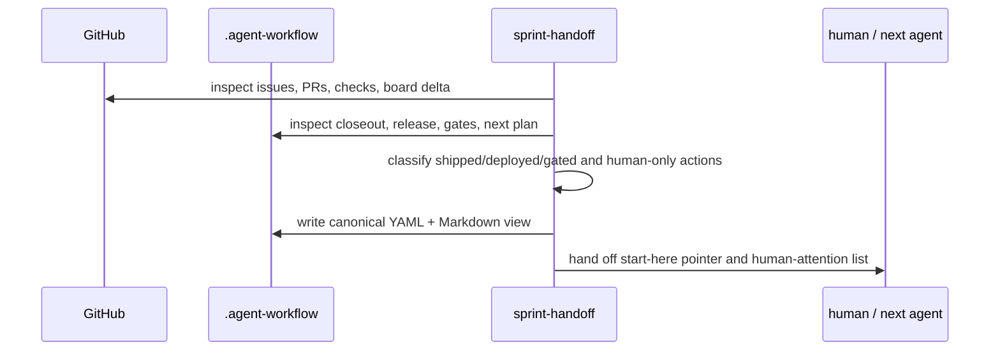

# sprint-handoff

**Lifecycle order:** 23 · **Modes:** `status-record`, `next-plan-summary`, `agent-handoff`, `human-attention` · **Owns schemas:** — (produces a canonical YAML packet and Markdown view)

> Produce a sprint-boundary handoff packet that separates what shipped, what is
> planned next, what a cold agent needs, and what requires human attention.

## Purpose

`sprint-handoff` makes banked sprint work legible before another human or agent
acts on it. It reports the previous sprint status of record, summarizes the next
planned sprint, captures agent handoff state, and presents the ordered
human-attention list. It reports and hands off; it does not approve plans,
dispatch lanes, merge code, rotate credentials, or deploy.

## When to use / when not

- **Use** when a sprint closes, a human returns mid-loop, another agent takes
  over, or banked work needs one executive packet before planning or dispatch.
- **Not** for comprehensive backlog strategy, approving a sprint, executing
  lanes, closing gates, or verifying runtime deployment.

## Position in the loop

Runs after sprint execution/release evidence exists and before the next planning
or dispatch decision. If direction is unclear, route to `state-of-union`; if a
plan needs executable lane contracts, route to `sprint-planning`.

## Modes

| Mode | What it does |
|---|---|
| `status-record` | Verify previous sprint claims and classify shipped, deployed, and gated/banked work. |
| `next-plan-summary` | Summarize the planned next sprint goal, topology, coverage, delivery split, and risks. |
| `agent-handoff` | Record baseline SHA, open PRs, in-flight branches/worktrees, open gates, gotchas, and start-here pointer. |
| `human-attention` | Produce the ordered owner/artifact/consequence list for approvals, rotations, decisions, and confirm-first windows. |

## Inputs (consumed)

| Input | Source |
|---|---|
| Closed sprint evidence | closeouts, critic/release packets, GitHub PRs/checks |
| Next sprint plan evidence | sprint plan, lane contracts, gates, issue board |
| Runtime/deployment claims | deployment records, probes, logs where applicable |
| Output structure | `skills/sprint-handoff/references/sprint-handoff.template.yaml` |

## Outputs (produced)

| Output | Schema | Consumed by |
|---|---|---|
| `.agent-workflow/sprints/<sprint-id>/handoff/sprint-handoff.yaml` | Template contract | humans, next agent, `state-of-union`, `sprint-planning` |
| `.agent-workflow/sprints/<sprint-id>/handoff/sprint-handoff.md` | Markdown rendering | humans, handoff comments, review packets |

## Sequence

## Gates & stop conditions

Stop when previous sprint or next plan artifacts are missing, live GitHub state
cannot be reached and cached state is stale, a green claim lacks a probe, or the
request asks the skill to approve, merge, dispatch, deploy, or close gates.

## Tools used

- Repository and `.agent-workflow` reads.
- GitHub issue, pull request, check, and board inspection.
- Runtime probes only to verify reported deployment claims; no deployment
  mutation is performed.

## Handoffs

- **Upstream:** `sprint-orchestrator`, `release-verification`, or human review
  when a sprint closes or work is banked.
- **Downstream:** `sprint-planning` for the next executable transaction,
  `sprint-orchestrator` after approval, or `state-of-union` when intent and
  delivery reality disagree.

## References

- `skills/sprint-handoff/SKILL.md`
- `references/sprint-handoff.template.yaml`
