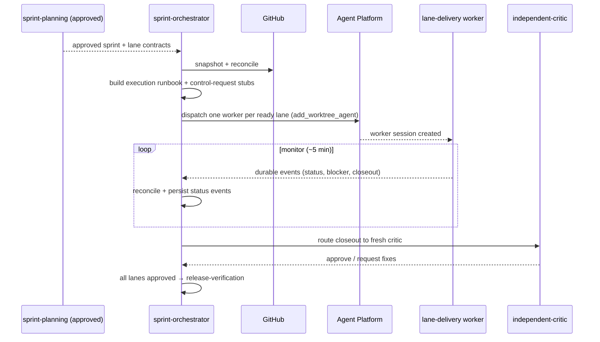

# sprint-orchestrator

**Lifecycle order:** 13 · **Modes:** `execution-runbook`, `platform-dispatch`, `monitor`, `reconcile`, `gate-management` · **Owns schemas:** `sprint-execution-runbook`, `status-event`

> Dispatch Agent Platform lane sessions and reconcile sprint execution; coordinate, never implement or self-review.

## Purpose

Turns an **approved sprint** into running lane work: builds the execution runbook,
dispatches one worker session per dependency-ready lane through the Agent Platform,
monitors durable lane events on a polling cadence, reconciles GitHub vs lease vs
contract, and routes completed lanes to criticism, review inbox, and release
verification.

## When to use / when not

- **Use** only after sprint and lane contracts are approved and the plan gate passed,
  including when an operator wants a controller that owns lane agents, dispatch,
  terminal visibility, CI/CD, and review-deployment coordination.
- **Not** for writing lane code or reviewing it — it stays in the controller role.

## Position in the loop

The dispatch + supervision half of **EXECUTE**. Pairs with `controller-loop` (durable
state/ledger). Consumes `sprint-planning` output; feeds `lane-delivery`,
`independent-critic`, and `release-verification`.

## Modes

| Mode | What it does |
|---|---|
| `execution-runbook` | Build/refresh `sprint-execution-runbook.yaml` (dispatch plan, cadence, session identities, CI/CD, ledger reqs). |
| `platform-dispatch` | Create exactly one worker worktree/session per ready lane via Agent Platform; record lease/session/PR. |
| `monitor` | Poll durable platform/session state and terminals; handle typed events, not chat narratives. |
| `reconcile` | Compare issue/PR/check/contract/lease/artifact state at each transition. |
| `gate-management` | Hold at human gates and coordination requests; route exceptions. |

## Inputs (consumed)

| Input | Schema / source | From |
|---|---|---|
| Approved sprint plan, lanes, wave release plan, plan gate | `sprint-plan`, `lane-contract`, `wave-release-plan`, `human-gate` | `sprint-planning` |
| Module contracts | `module-contract` | `architecture-contracts` |
| Live GitHub snapshot/reconcile | issues/PRs/checks | GitHub |
| Controller state + ledger | `controller-state`, `session-ledger` | `controller-loop` |

## Outputs (produced)

| Output | Schema | Consumed by |
|---|---|---|
| `…/execution/sprint-execution-runbook.yaml` | `sprint-execution-runbook.schema.yaml` | dispatch, recovery |
| `…/status.yaml` + status events | `status-event.schema.yaml` | controller-loop, dashboards |
| Per-lane Agent Platform control-request stubs | `agent-platform-control-request.schema.yaml` | platform-readiness, audit |

## Sequence

## Gates & stop conditions

Never dispatch two workers into one lane/worktree. Do not bypass required checks,
reviews, or deployment approvals; do not self-approve a plan exception; do not close a
sprint before release verification and outcome review; do not launch an unauthorized
execution substrate.

## Tools used

- **CLI:** `bin/verdify github snapshot` / `github reconcile` / `lane create`;
  `scripts/build_execution_runbook.rb`, `scripts/build_platform_control_requests.rb`.
- **MCP/API:** Agent Platform dispatch (`add_worktree_agent`,
  `POST /api/repos/{owner}/{name}/agents`); terminals (`GET /api/tty`).
- **GitHub:** issues, PRs, checks, deployments.

## Handoffs

- **Upstream:** `sprint-planning` (approved plan), `controller-loop` (durable state).
- **Downstream:** `lane-delivery` (ready worker) · fresh `independent-critic`
  (closeout) · `release-verification` (all lanes approved) · `sprint-planning`
  (material replan) · `platform-readiness` / gate owner (CI/CD or readiness gap).

## References

- `skills/sprint-orchestrator/SKILL.md`, `references/platform-execution.md`,
  `references/state-machine.md`, `references/gate-management.md`,
  `references/github-reconciliation.md`
- [ADR-0012](../../decisions/ADR-0012-controller-loop-vs-orchestrator-ownership.md)
