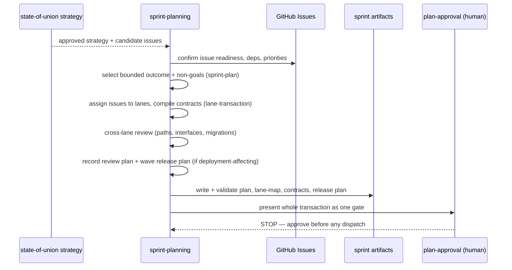

# sprint-planning

**Lifecycle order:** 12 · **Modes:** `issue-readiness`, `sprint-plan`, `lane-transaction`, `review-plan`, `wave-release-plan`, `plan-approval` · **Owns schemas:** `sprint-plan`, `lane-contract`, `lane-map`, `wave-release-plan` (also uses `human-gate`)

> Select approved GitHub Issues for a bounded sprint and atomically create the sprint plan, lane topology, executable lane contracts, review plan, and wave release plan.

## Purpose

The **atomic planning transaction**. From ready GitHub Issues named by an approved
state-of-union strategy, it produces one approved, executable sprint: a bounded outcome
with explicit non-goals, a lane topology, one compiled contract per lane, a
stakeholder-readable review plan, and — when delivery is deployment-affecting — a wave
release plan. Selection, decomposition, and contract compilation run as one transaction
because topology is not safe until ownership and interfaces are concrete. GitHub Issues
remain the backlog; the sprint plan records the approved delivery snapshot.

## When to use / when not

- **Use** after approved state-of-union strategy names ready candidate issues, when
  planning the next delivery slice, when asked what is in / deferred / owned / reviewable
  / scheduled for QA or human review, or when a sprint must be replanned before dispatch.
- **Not** to invent private backlog items (create or propose GitHub issues instead),
  expand scope, create leases or worktrees, or dispatch workers — those belong to
  `sprint-orchestrator` after approval.

## Position in the loop

The **PLAN** transaction. Downstream of [state-of-union](./state-of-union.md), it converts
ready candidate issues into one approved sprint and then **stops at the plan-approval
gate** — it never creates leases or worktrees. After approval it hands to
[sprint-orchestrator](./sprint-orchestrator.md), which dispatches lanes when dependencies
are ready.

## Modes

| Mode | What it does |
|---|---|
| `issue-readiness` | Verify each candidate issue states problem/outcome, acceptance intent, risk, dependencies, and exclusions; create or propose missing issues. |
| `sprint-plan` | Choose the smallest provable bounded outcome and explicit non-goals; record milestone/Project links, baseline SHA, acceptance criteria, risks, deployment expectations, and gates. |
| `lane-transaction` | Assign each issue to exactly one lane, write the lane map, and compile each lane contract (ownership, deps, runtime namespace, validation, evidence, Git policy, escalation, DoD). |
| `review-plan` | Record the stakeholder answer: included/deferred work, lane owners/reviewers, dependency order, QA + human-review milestones, packet paths, and user stories for review. |
| `wave-release-plan` | For deployment-affecting work, record branch/merge model, required checks/events, CI workflows, environments, GitOps desired state, deployment strategy, rollback, release health, and review inbox handoff. |
| `plan-approval` | Present the whole transaction as one gate; do not dispatch before approval. |

## Inputs (consumed)

| Input | Schema / source | From |
|---|---|---|
| Approved definition, architecture, module contracts | `project-definition`, `architecture`, `module-contract` | upstream lifecycle |
| Locked North Star | `NORTHSTAR_PRODUCT.md`, `NORTHSTAR_ARCHITECTURE.md`, `northstar-artifacts.yaml` | `northstar-planning` |
| Approved strategy + candidate issues | `state-of-union` | [state-of-union](./state-of-union.md) |
| Current issues, dependencies, priorities | GitHub Issues | GitHub control plane |
| Baseline SHA + repository conventions | Git | repo |

## Outputs (produced)

| Output | Schema | Consumed by |
|---|---|---|
| `.agent-workflow/sprints/<id>/sprint-plan.yaml` (+ `sprint-plan.md`) | `sprint-plan.schema.yaml` | `sprint-orchestrator`, `controller-loop`, stakeholders |
| `.agent-workflow/sprints/<id>/lanes/lane-map.yaml` | `lane-map.schema.yaml` | `sprint-orchestrator` |
| `.agent-workflow/sprints/<id>/lanes/contracts/<lane>.contract.yaml` | `lane-contract.schema.yaml` | [lane-delivery](./lane-delivery.md), `independent-critic` |
| `.agent-workflow/sprints/<id>/gates/plan-approval.yaml` | `human-gate.schema.yaml` | human/operator |
| `.agent-workflow/sprints/<id>/release/wave-release-plan.yaml` (deployment-affecting) | `wave-release-plan.schema.yaml` | `sprint-orchestrator`, `release-verification` |

## Sequence

## Gates & stop conditions

The default unit is **one issue → one lane → one contract → one branch → one worktree →
one PR**. Multiple issues share a lane only when inseparable at acceptance and merge
boundaries, with a recorded `coupling_justification` plus explicit approval. Before
approval verify: no issue is in two lanes, every lane has an issue, owned/prohibited paths
do not conflict, hard dependencies form an executable order, runtime namespaces avoid
collisions, every criterion has a validation/evidence path, and branch names and baseline
SHAs are fixed. **STOP at the plan-approval gate — do not dispatch.** Route back to
strategy, architecture, platform readiness, or human approval when branch identity
conflicts with the default, required checks cannot run on the planned events, environments
lack quota/network/secret/TTL policy, or rollback readiness is not credible.

## Tools used

- **CLI:** `bin/verdify sprint init --id SPRINT-ID` (draft sprint skeleton + approval
  gate); `bin/verdify artifact validate --file PATH` (validate each plan, lane-map,
  contract, and release plan against its `schema_ref`) — see [tools-and-mcp](../tools-and-mcp.md).
- **GitHub:** read issue, dependency, and priority state for selection and readiness.

## Handoffs

- **Upstream:** [state-of-union](./state-of-union.md) (approved strategy + candidate issues).
- **Downstream:** [sprint-orchestrator](./sprint-orchestrator.md) after approval — it, not
  the planner, creates leases/worktrees when deps are ready. On material scope, interface,
  baseline, or dependency change, pause affected lanes and replan the transaction.

## References

- `skills/sprint-planning/SKILL.md`, `references/issue-readiness.md`,
  `references/planning-method.md`, `references/lane-transaction.md`,
  `references/review-and-reporting.md`, `references/wave-release-planning.md`
- [schemas catalog](../schemas-catalog.md) · [tools and MCP](../tools-and-mcp.md)
