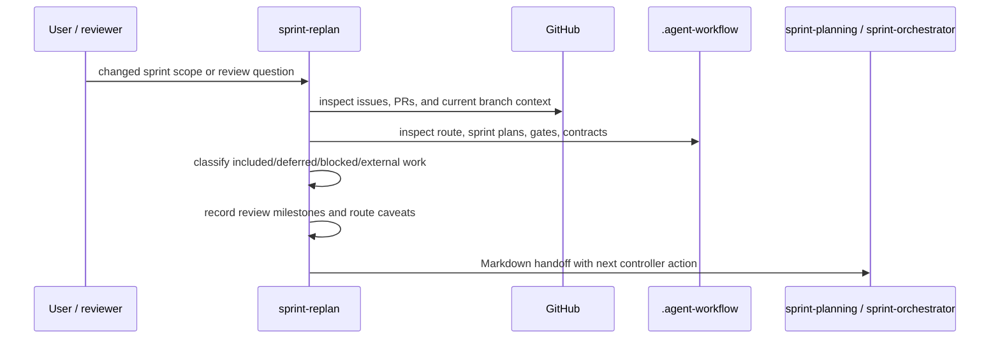

# sprint-replan

**Lifecycle order:** 13 · **Modes:** `intake`, `scope-replan`, `markdown-handoff`, `route-caveat` · **Owns schemas:** — (produces a standard Markdown handoff)

> Replan an existing or proposed sprint into a concise Markdown handoff with
> issue-backed scope, deferred work, review milestones, and route caveats.

## Purpose

`sprint-replan` is a planning facade for moments when a sprint needs to be
reshaped before execution. It consumes user constraints, review feedback, open
issues/PRs, route decisions, and existing sprint artifacts, then produces a
human-readable handoff that `sprint-planning` or `sprint-orchestrator` can act
on. It does not create lane leases, open worker sessions, or replace the
approved sprint-planning transaction.

## When to use / when not

- **Use** when a human asks what the next sprint includes, changes sprint scope,
  clarifies external ownership, asks for review milestones, or needs a concise
  controller-ready handoff.
- **Not** for creating executable lane contracts, acquiring leases, merging PRs,
  or approving protected North Star, architecture, security, or deployment
  decisions.

## Position in the loop

Runs after `sprint-planning` input has drifted or before a controller executes an
already approved plan. Its output can feed `sprint-planning` for a full
transaction, or `sprint-orchestrator` when the bounded exception and lane
contracts already exist.

## Modes

| Mode | What it does |
|---|---|
| `intake` | Reconstruct issues, PRs, route decisions, sprint artifacts, and new human constraints. |
| `scope-replan` | Classify each candidate as include, defer, blocked, needs_issue, or external_dependency. |
| `markdown-handoff` | Write the standard Markdown handoff under `docs/sprint-plans/`. |
| `route-caveat` | Record router mismatches, approval needs, policy exceptions, and ownership splits. |

## Inputs (consumed)

| Input | Source |
|---|---|
| User constraints or review feedback | user request, pasted notes, review comments |
| Backlog truth | GitHub Issues and PRs |
| Lifecycle state | `.agent-workflow` artifacts, `bin/verdify route` |
| Output contract | `skills/sprint-replan/references/markdown-output.md` |

## Outputs (produced)

| Output | Schema | Consumed by |
|---|---|---|
| `docs/sprint-plans/<date>-<slug>.md` | Markdown contract | `sprint-planning`, `sprint-orchestrator`, human review |

## Sequence

## Gates & stop conditions

Stop when proposed work lacks GitHub issues, protected North Star or
architecture artifacts would be rewritten without approval, or the request is
for a full executable sprint transaction. Route those cases to `issue-triage`,
`northstar-planning`, or `sprint-planning` as appropriate.

## Tools used

- **Repository:** read `.agent-workflow`, docs, branch status, validation output.
- **GitHub:** read issues, pull requests, review comments, and check status.
- **CLI:** `bin/verdify route --json` when lifecycle position matters.

## Handoffs

- **Upstream:** human review, `state-of-union`, `sprint-planning`, or
  `sprint-orchestrator` when new constraints appear.
- **Downstream:** `sprint-planning` for a formal transaction, or
  `sprint-orchestrator` when approved lane contracts already exist.

## References

- `skills/sprint-replan/SKILL.md`
- `references/markdown-output.md`
