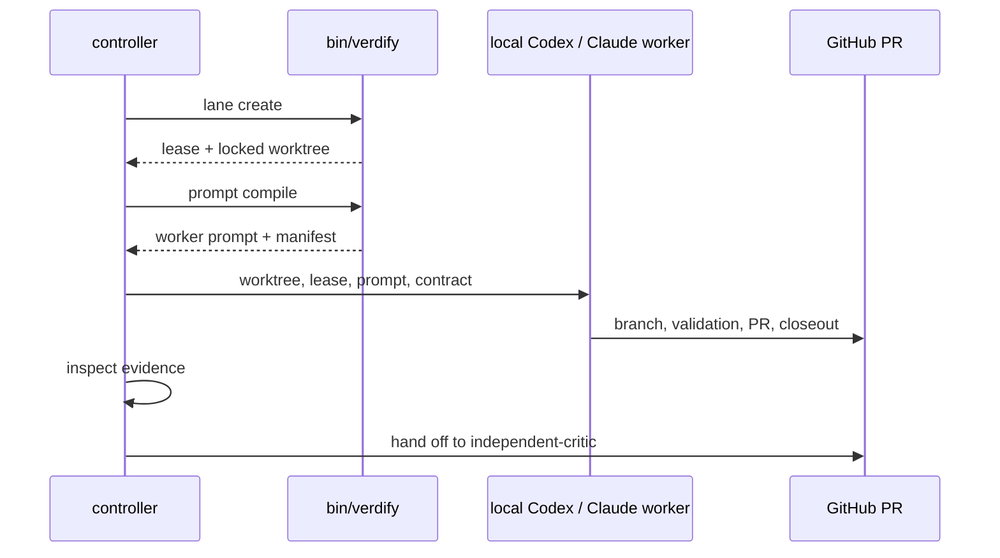

# subagent-worktree

**Lifecycle order:** 15 · **Modes:** `dispatch`, `prompt-bind`, `monitor`, `critic-handoff` · **Owns schemas:** — (uses lane lease and compiled prompt schemas)

> Launch one local Codex or Claude worker in one isolated Verdify worktree with
> a recorded lease, prompt, closeout expectation, and critic handoff.

## Purpose

`subagent-worktree` gives a controller a concrete local-worker fallback when
Agent Platform dynamic worktree agents are unavailable or intentionally out of
scope. It preserves Verdify's execution invariants: one issue, lane, branch,
worktree, worker session, and pull request by default; no hidden chat-state
authority; no self-certification.

## When to use / when not

- **Use** when a controller must launch a local Codex or Claude subagent into an
  approved lane worktree and record lease/prompt/closeout evidence.
- **Not** for implementing the lane yourself, launching multiple workers into
  the same worktree, bypassing platform-readiness policy, deploying runtime
  changes, or approving protected decisions.

## Position in the loop

Runs inside execution alongside `sprint-orchestrator` and `controller-loop`. It
does not replace `lane-delivery`; it prepares and supervises the local worker
that performs lane delivery.

## Modes

| Mode | What it does |
|---|---|
| `dispatch` | Create or inspect one worker lease and one isolated worktree. |
| `prompt-bind` | Compile the worker prompt and bind it to contract, lease, branch, and path. |
| `monitor` | Poll branch, PR, closeout, validation, and worker status evidence. |
| `critic-handoff` | Release or preserve the worker worktree and route closeout to fresh criticism. |

## Inputs (consumed)

| Input | Source |
|---|---|
| Approved sprint and lane contract | `.agent-workflow/sprints/**` |
| Lease and prompt commands | `bin/verdify lane create`, `bin/verdify prompt compile` |
| Local fallback policy | human gate or approved route exception |
| Dispatch checklist | `skills/subagent-worktree/references/local-dispatch.md` |

## Outputs (produced)

| Output | Schema | Consumed by |
|---|---|---|
| Lane lease | `lane-lease.schema.yaml` | controller, worker, critic |
| Compiled worker prompt manifest | `compiled-prompt-manifest.schema.yaml` | worker, controller |
| Worker PR and closeout refs | GitHub + `lane-closeout.schema.yaml` | `independent-critic` |

## Sequence

## Gates & stop conditions

Stop when a lane already has an active worker lease, local dispatch lacks an
approved fallback gate, the contract is stale, the worktree identity conflicts,
or the worker asks for protected production, schema, security, migration, or
destructive authority.

## Tools used

- `bin/verdify lane create`, `lane inspect`, `lane release`
- `bin/verdify prompt compile`
- Git and GitHub PR surfaces for branch, closeout, and validation evidence

## Handoffs

- **Upstream:** `sprint-orchestrator` or `controller-loop`.
- **Downstream:** `lane-delivery` worker execution, then `independent-critic`.

## References

- `skills/subagent-worktree/SKILL.md`
- `references/local-dispatch.md`
