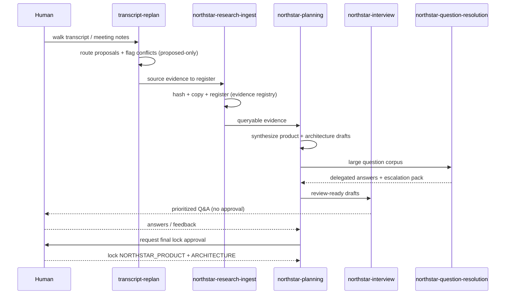
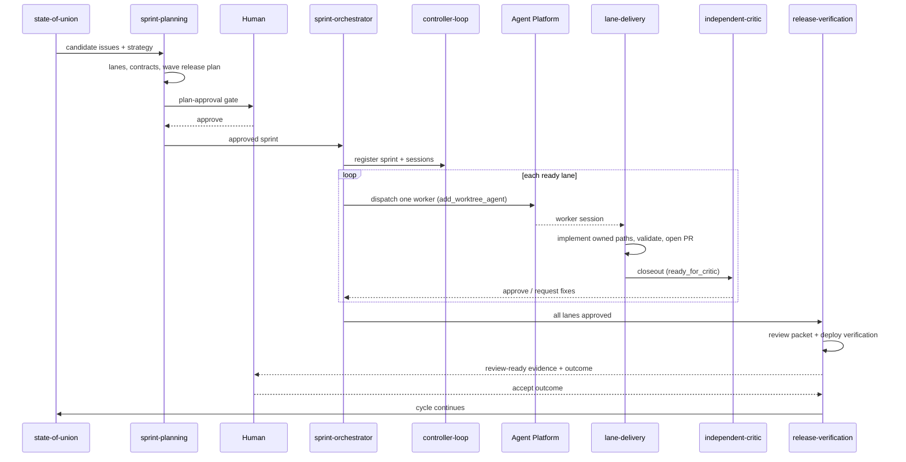
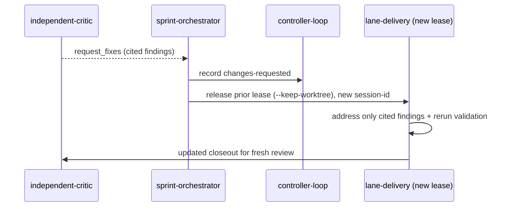
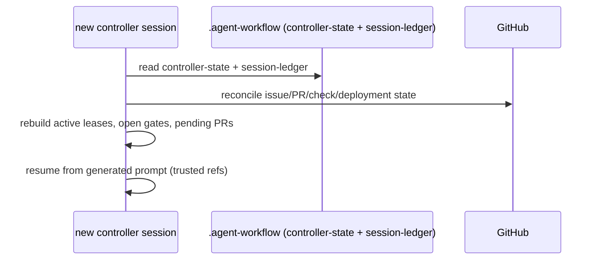
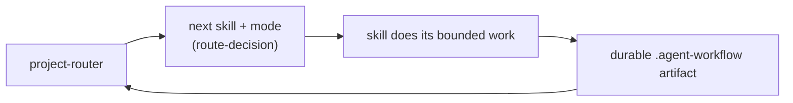

# End-to-end sequences

Mermaid sequence diagrams for the main flows. Each participant is a skill (or
GitHub / Agent Platform / human). For per-skill detail see [`per-skill/`](per-skill/).

## 1. Intake → North Star lock

How conversational and research input becomes locked planning authority. Ordinary
questions restart the loop; only the final lock is a human gate.

## 2. Plan → execute → verify → review (the delivery heart)

From approved strategy to a verified, accepted wave. CI green is necessary but not
sufficient: a fresh critic and review evidence gate integration.

## 3. Fix-forward after critic findings

A rejected lane re-enters delivery under a new sequential lease — never the same
active worker session.

## 4. Controller recovery

A controller pod/session restart reconstructs from durable artifacts, not chat history.

## 5. Router cycle

`project-router` is the entrypoint and the return point after every handoff.

